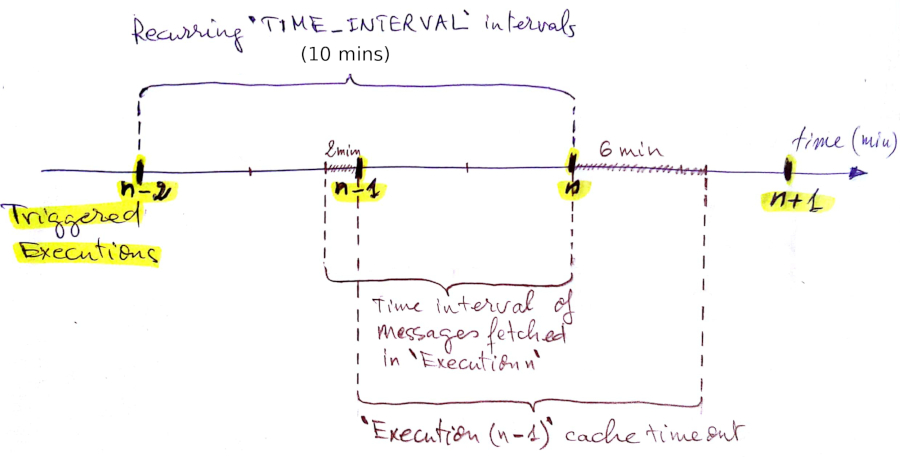

# Gmail Autoresponder

**Gmail Autoreponder** is a configurable **[Google Apps Script](https://developers.google.com/apps-script/reference/)** web application to automatically send a canned reply to messages received on a Gmail inbox within a specified time interval of each day. The application will be tied to two data stores ~~~ which are currently Google Spreadsheets // only Google Spreadsheets are currently supported ~~~:
* `Filters spreadsheet`: containing patterns (regular expressions) to filter received messages by their headers content
* `Logs spreadsheet`: to log executions and processed messages meta-data

## How it works?
* ...
* Filter can be regex or any plain text expression without any [special characters](https://stackoverflow.com/a/400316/3208373) that need to be escaped.
*

### Configurations
You can set the following configurations using the web frontend:
* `XXXXX XXXXX`: ... ...

**Gmail Autoreponder**'s main script `main.js` is meant to be executed daily on a recurring interval of `TIME_INTERVAL` mintues from `START_HOUR` to `FINISH_HOUR` (local time).

A series of [triggered executions](https://developers.google.com/apps-script/guides/triggers/installable#time-driven_triggers) within a 24 hours span (e.g. from __05-Sep-2018 @7:00pm__ to __06-Sep-2018 @7:00am__) is called a `session`.

When the main function `autoReply()` is executed (by a trigger), issued Gmail search query `GM_SEARCH_QUERY`, execution time and the number of returned threads are logged to `Logs spreadsheet`. This execution is referred to as `Execution n`, and the previous one as `Execution (n-1)`.

Although `Execution (n-1)` would normally have occured `TIME_INTERVAL` minutes ago, received messages are fetched from the last `TIME_INTERVAL + 2` minutes, in order not to miss any messages in case of delays.

The issued [Gmail search query](https://developers.google.com/apps-script/reference/gmail/gmail-app#search%28String%29) `GM_SEARCH_QUERY` will then return an array of [threads](https://developers.google.com/apps-script/reference/gmail/gmail-thread) updated in the specified time interval, from which the latest [messages](https://developers.google.com/apps-script/reference/gmail/gmail-message) will be retrieved; these would be the `processed messages` to be either:

* __responded to__, with the content of `body.html` file in the same Google Apps Script project; they are then [starred](https://developers.google.com/apps-script/reference/gmail/gmail-message#star) and have their meta-data logged to `Logs spreadsheet` with the `REP_SENT` label;
* or __skipped__, if they contain one of the blacklisted words/expressions defined in `Filters spreadsheet`; then they are starred and have their meta-data logged to `Logs spreadsheet` with the `SKIPPED` label.

Examples of values predefined in the `Filters spreadsheet`:
- **`RAWMSG_BLACKLIST`**: `report-type=disposition-notification`; to filter out read receipts,
- **`FROM_BLACKLIST`**: `(^|<)((mailer-daemon|postmaster)@.*)`; to filter out delivery reports,
- **`TO_BLACKLIST`**: `undisclosed-recipients`; to filter out potential spams.

[IDs](https://developers.google.com/apps-script/reference/gmail/gmail-message#getId%28%29) of `processed messages` from `Execution (n-1)` are [cached with a 16 minutes timeout](https://developers.google.com/apps-script/reference/cache/cache#put%28String%2CString%2CInteger%29). During `Execution n`, IDs of retrieved messages are checked against this cache to determine whether they were already processed or not. Thus, we leave little to no chance of sending an automated message more than once in response to the same email.

`archive_logs.js` script should be run on the first day of each month to archive previous month log (of processed messages) in a separate sheet named `MONTH_YY` and clear the "executions" log.

### Application logic flowchart

...

## Motivations / Principles / History / Justify choices

* **Gmail Autoresponder** was inspired by an [answer](https://webapps.stackexchange.com/a/90089) on Stack Exchange Web Applications forum.
* The application was initially *** where most configurations were hard-coded ** and features got little by little abstracted
* As there is no event triggered on email reception ... *** then most features and configurations were abstracted for better app modularity and code readability.
* One backend application with a single access point (REST API), that will interface with all needed Google Services (Gmail and Spreadsheets, in our case) ** which the user will explicitly grant access to, all at once. This should make the web application more flexible, customizable and easier to maintain.
* The application is shipped in two versions:
    * Backend and frontend all hosted and run on Google Apps Script platform. The user should be logged in to his Google Account in order to access the web application.
    * Backend on Google Apps Script, deployed as "API Executable". This opens more choices of client and frontend apps.
* I have given up the idea of making a "client-only app" and interact directly with Apps Script backend with a plain HTML5 file that could even be stored locally, as it seems that it's a good practice to implement a minimal sever-side authentication logic [https://stackoverflow.com/q/18280827/3208373] , [https://security.stackexchange.com/a/52886/37487]
    * "...the JavaScript app is just plain old HTML and JS served from the same server to avoid XSS issues." [source](https://security.stackexchange.com/questions/19620/securing-a-javascript-single-page-app-with-restful-backend#comment32548_19625)
    * "JAM stack" paradigm trend
        * PWA: progressive web apps
        * SSR: server side rendering
            * Pros and some Cons of SSR (Vue.JS focused, but pretty generic)
                * [Vue SSR Guide | Vue.js Server-Side Rendering Guide](https://ssr.vuejs.org/#what-is-server-side-rendering-ssr)
        * SPA: single page application
    * I have been analyzing local KeeWeb, for oauth authentication
        * Remembering the lastest used location for key file (not browser's wide)
    * [oauth - Security drawbacks for using short-lived access token in javascript client side - Information Security Stack Exchange](https://security.stackexchange.com/questions/13618/security-drawbacks-for-using-short-lived-access-token-in-javascript-client-side)
    * stateless
    * "...use 2-legged or 3-legged OAuth on the REST back end?"

## Installation and use

### Manual Installation
* While logged in to your Google account, go to [Apps Script Dashboard](https://script.google.com/) and create an new Google Apps Script Project by clicking on **`+ New script`**.
* Create two new Google Spreadsheets using the following templates:
    - Filters: [Gmail Autoresponder - Filters template](https://docs.google.com/spreadsheets/d/1pdbsI6gaKcv3zLVwnFHosOD-0b1eVUvMN_mJQYNogMc)
    - Logs: [Gmail Autoresponder - Logs template](https://docs.google.com/spreadsheets/d/1TyU0XlutRS4sBXCvtPa8AyrlEPfEuiSEoIbAKcYiSzU)
* ...
* Script properties / appsscript.json (manifest)
    * scopes
    * timezone
* Set triggers
* For a first time, run the application manually in order to set authorizations
* Filters file: all messages whose contents match any of the regular expressions will be skipped.

### Automatic ...
...

## Advanced
* Google Apps Script apps hosted by free Google accounts are subject to Apps Script services [quotas and limitations.](https://developers.google.com/apps-script/guides/services/quotas). You can check your total runtime with `Stackdriver Logging` under `View` menu.
    * [Logging  |  Apps Script  |  Google Developers](https://developers.google.com/apps-script/guides/logging)

## Troubleshooting

* You search gmail message by its Gmail ID. Note that the ID of a Gmail thread is the ID of its first message.
* Example of errors (Apps Script backend's) I ever had:

| Start            | Function    | Error Message                                                                                                                                    | Trigger    | End              |
|------------------|-------------|--------------------------------------------------------------------------------------------------------------------------------------------------|------------|------------------|
| 10/07/2018 20:06 | autoReply   | Limit Exceeded: Email Body Size. (line 99, file "Code")                                                                                          | time-based | 10/07/2018 20:06 |
| 10/04/2018 20:43 | autoReply   | Document 1qjB-QoZ17jLql6g4Zz1l6-xV8xlVlXu3I1m52WZOMrY is missing (perhaps it was deleted, or you don't have read access?) (line 22, file "Code") | time-based | 10/04/2018 20:44 |
| 9/17/18 12:53 AM | autoReply   | Service error: Spreadsheets (line 63, file "Code")                                                                                               | time-based | 9/17/18 12:53 AM |
| 7/26/18 11:16 PM | autoReply   | Gmail operation not allowed. (line 62, file "Code")                                                                                              | time-based | 7/26/18 11:16 PM |
| 4/24/18 4:52 AM  | autoReply   | Service timed out: Spreadsheets (line 63, file "Code")                                                                                           | time-based | 4/24/18 4:53 AM  |
| 3/23/18 10:46 PM | autoReply   | We're sorry, a server error occurred. Please wait a bit and try again.                                                                           | time-based | 3/23/18 10:46 PM |
| 1/25/18 8:22 PM  | autoReply   | We're sorry, a server error occurred. Please wait a bit and try again. (line 125, file "Code")                                                   | time-based | 1/25/18 8:24 PM  |
| 12/01/2017 08:45 | archive_log | Sorry, it is not possible to delete all non-frozen rows. (line 26, file "Archive_Log")                                                           | time-based | 12/01/2017 08:45 |
| 10/02/2017 20:58 | autoReply   | Argument too large: subject (line 97, file "Code")                                                                                               | time-based | 10/02/2017 20:58 |
| 10/01/2017 08:02 | archive_log | You do not have permissions to access the requested document. (line 11, file "Archive_Log")                                                      | time-based | 10/01/2017 08:02 |
| 8/30/17 11:06 PM | autoReply   | Invalid email: Judith Pin &lt;&gt; (line 92, file &quot;Code&quot;)                                                                              | time-based | 8/30/17 11:06 PM |

## TODOs / Road map

- [ ] Make the script API Executable
    - The [Google Apps Script API](https://developers.google.com/apps-script/api/) replaces and extends the [Apps Script Execution API](https://developers.google.com/apps-script/api/how-tos/execute). The Apps Script API allows your apps to perform operations that previously could only be done in the Apps Script editor.
    - Use either the hidden Cloud Platform project the newly created Apps Script project is associated to by default, or switch to a different Google Cloud Platform project. For more information check the following pages:
        - [Executing Functions using the Apps Script API  |  Requirements](https://developers.google.com/apps-script/api/how-tos/execute#requirements)
        - [Cloud Platform Projects](https://developers.google.com/apps-script/guides/cloud-platform-projects#accessing_an_apps_script_cloud_platform_project)
- [ ] Abstracting logging and filters reading operations in order to make it easy to use other and generic data formats like JSON, XML or any API accessible data store.
    - https://developers.google.com/apps-script/reference/content/
- [ ] Custom time interval of each selected week day.
- [ ] Automatic handling of local time using, for example, Google Time Zone API: instead of manually setting offset in order to adjust the time following the local daylight savings rules.
- [ ] Script to automatically deploy the application and update it as a Google Apps Script project (See DevOpSnippets)
    - [ ] Gmail Autoresponder Deployer (as a Google Cloud Platform app)
    - [ ] [Command Line Interface using clasp  |  Apps Script  |  Google Developers](https://developers.google.com/apps-script/guides/clasp)
    - [ ] [Importing and Exporting Projects  |  Apps Script  |  Google Developers](https://developers.google.com/apps-script/guides/import-export)
    - [ ] Change app settings by programmatically updating project manifest `appsscript.json`.
- [ ] Log why skipped messages (i.e. messages that have not been responded to) were filtered out.
- [ ] Optimize writing to Google Sheets for large data:
    - [ ] [Custom Functions in Google Sheets](https://developers.google.com/apps-script/guides/sheets/functions)
- [ ] Web front-end to configure the application:
    - [ ] enable disable the application
    - [ ] customize filters
    - [ ] set start/end hours, execution time interval
    - [ ] view/export logs
    - [ ] Edit sending settings: Cc address, weither or not to use "no-reply" address (G-Suite users)
- [ ] On `Filter spreadsheet`, save processed messages IDs as hyperlinks to the corresponding Gmail webmail pages. E.g. `https://mail.google.com/mail/u/0/#inbox/1662ab6df6e32ab0`
- [ ] Provide the application as service / Make an API: Allow the execution of the application from both the web frontend of using a "pseudo" RESTful-API. Useful if you want, for example, fetch correct local time from third-party sources and feed it to the application.
- [ ] Centrally manage multiple users
- [ ] Updater
- [ ] v2.0: Use with any email provider (IMAP/SMTP, RESTful API)
- [ ] Publish/Distribute the web app on Google Chrome Web Store.

## Notes
-

## Change log

* ...
* ...

## Dependencies / used components
* Frontend
    * Material Design Lite
    * `getmdl-select`
    * jQuery
    * Material Icons
    * Some Google fonts

## Resources / Credits & Thanks
* [CodePen - Customer Search](https://codepen.io/verybradthings/full/KMNMKJ)
* [CodePen - A Pen by David Hutchinson](https://codepen.io/shinnkun/full/ONWayP)
* [RawGit](https://rawgit.com/)
* [Material Design Lite](https://getmdl.io/components/index.html#textfields-section)
* [Icons - Material Design](https://material.io/tools/icons/?style=baseline)
* Not used: [Multirange: A tiny polyfill for HTML5 multi-handle sliders.](https://leaverou.github.io/multirange/)
* [CodePen - A Pen by Jan Rolf Jakobsen](https://codepen.io/ChanRholf/full/KXexEP/)
* [Material Design Lite - getmdl-select](https://creativeit.github.io/getmdl-select/)
* [Material Design Lite - Custom CSS theme builder](https://getmdl.io/customize/index.html)
* [GitHub - purifycss/purifycss](https://github.com/purifycss/purifycss)

## License

Copyright © 2018 Amine Al Kaderi

This software is released under the GNU GPLv3 license. For more information read the [license](https://www.gnu.org/licenses/gpl-3.0.txt).

For third party software licenses, please check [licenses.md](licenses.md)
