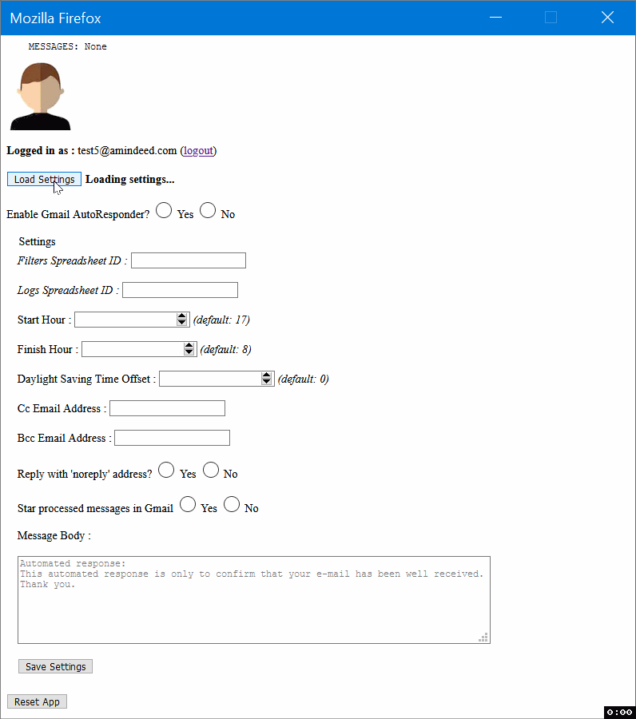
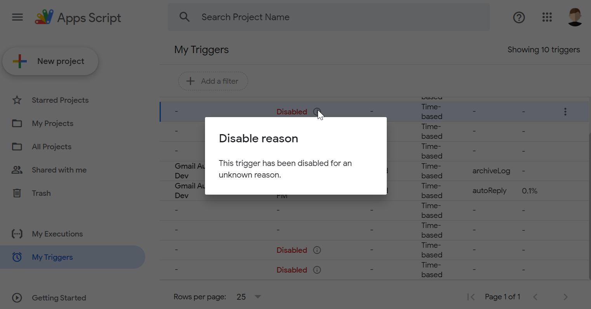

# Work Log

## 2023-12-29: _TODO_

- ***Setup (1/2):*** 
    - `Bash`: Configure NGINX, WSGI and Certbot.
    - Finish Bash script and/or port to a Python script.
    - Unit tests.
    - Draft a simple CI/CD pipeline.
- ***Middleware (1/2):***
    - Form data validation.
    - Better error handling.
- ***Frontend:***
    - Complete form fields and commands
    - Responsive (Bootstrap)
    - Thoroughly test AJAX requests
- ***Setup (2/2):***
    - Design as a pipeline with inputs and outputs, covering all deployment stages.
    - Automate configuration and deployment
    - Deploy as a Docker image.
- ***Middleware (2/2):***
    - Implement API gateway. Test full workflow (e.g. with Postman).
- ***Core:***
    - Testing (with Middleware and frontend).
    - 1 or 2 more **`BaseLogger`** sub-classes.
    - **`query()`** method for `BaseLogger` class.
- ***README:***
    - `main()` flowchart
    - Setup pipeline diagram

## 2021-04-28

- It would be better to deploy the Core (Apps Script) app using the Google API Python client library instead of `clasp`. This saves ~100 MB of disk space and leverages installed project (Middleware app's) dependencies. Some useful resources in this regard:
    - [Google Apps Script API Python Quickstart](https://github.com/googleworkspace/python-samples/tree/master/apps_script/quickstart)
    - [Google's discovery based APIs: *Apps Script API*](https://googleapis.github.io/google-api-python-client/docs/dyn/script_v1.html)

## 2021-04-10

- Studying project setup as a pipeline to make the process as automatable as possible, and the Bash script easily convertible.
- Resources:
    - [makeusabrew/bootbox: Wrappers for JavaScript alert(), confirm() and other flexible dialogs using Twitter's bootstrap framework](https://github.com/makeusabrew/bootbox)
    - [How to create flow charts in draw.io - draw.io](https://drawio-app.com/flowcharts/)
    - [Flowcharts Describing Loops - Problem Solving with Python](https://problemsolvingwithpython.com/09-Loops/09.04-Flowcharts-Describing-Loops/)


## 2021-04-08

- Further enhancements of the setup script. Published a new execution demo as a [asciicast](https://asciinema.org/a/9mZzpFW7Ie86P2kGTbKct9vbT), and added a sample output (as a HTML file).
- Revised the "Setup" section of the README file.
- Plans for upcoming updates of the setup script
    - Interactive or automatic (retries...).
    - Enable/Disable debugging; Levels: Info/Success, Warning, Error.
    - Revert changes back in case of an error.
    - User should have read/write access rights to the current directory.
    - User should be a 'sudoer'.
- About [`clasp deploy`](https://github.com/google/clasp#deploy) and Google Apps Script project [versions](https://developers.google.com/apps-script/concepts/deployments#versioned_deployments) *(summary for future reference)*:
    - It is possible to create immutable versions of a script.
    - Each version can have multiple deployments (each with its own deployment ID) or redeployed (which create a new deployment with a new ID).
    - When a Apps Script project is redeployed using an existing deployment ID, a new version is automatically created.
- Interesting resources:
    - [How to Update Your Live Django Website | Towards Data Science](https://towardsdatascience.com/how-to-update-your-live-django-website-b84645753ea1)
        - [Automating Django Deployments with Fabric and Ansible – Real Python](https://realpython.com/automating-django-deployments-with-fabric-and-ansible/)
    - [scripting - How to determine if a bash variable is empty? - Server Fault](https://serverfault.com/a/382740/205939)

## 2021-04-05

- Up to now, `setup_centos7.sh` deploys Gmail AutoResponder web-app in **Development/Test** mode.
- Published an asciicast: [Gmail AutoResponder - Dev/Test Deployment](https://asciinema.org/a/EDpbwZVOK6rGogNFHiwo3xGJQ)
- Added sample execution output of `setup_centos7.sh` on a base CEntOS 7 system ([`setup_centos7_output.html`](setup_centos7_output.html)).
- Revising "Setup and Run" section of README.

## 2021-04-03

Been developing, enhancing and thoroughly testing a setup bash script: [`setup_centos7__draft.sh`](https://github.com/amindeed/Gmail-AutoResponder/blob/978534092cbc1030d0ac8f78e75bcd832f8df027/setup_centos7__draft.sh).

## 2021-03-30

- The `setup__draft.sh` can now be pretty much run for a guided and semi-automatic initial configuration. The script is still unfinished though.
- I believe it makes some sense to try first to configure and deploy the code manually (using Bash) before using a CI/CD or a configuration management tool.
- Online resources:
    - [[EPEL] How to install Python 3.6 on CentOS 7](https://stackoverflow.com/a/23317640/3208373)
    - [nginx + uwsgi + virtual environment. What goes inside?](https://stackoverflow.com/a/29134999/3208373)
    - [Restructuring Django’s Settings](https://www.digitalocean.com/community/tutorials/how-to-harden-your-production-django-project#step-1-%E2%80%94-restructuring-django%E2%80%99s-settings)
    - SQLite version issue:
        - Chosen solution:
            - ★ [How to override an old sqlite3 module with pysqlite3 in django settings.py](https://gist.github.com/defulmere/8b9695e415a44271061cc8e272f3c300)
            - [charles leifer | Compiling SQLite for use with Python Applications](https://charlesleifer.com/blog/compiling-sqlite-for-use-with-python-applications/)
        - [python - django can't find new sqlite version? (SQLite 3.8.3 or later is required (found 3.7.17)) - Stack Overflow](https://stackoverflow.com/questions/55674176/django-cant-find-new-sqlite-version-sqlite-3-8-3-or-later-is-required-found)

            ```
            $ wget https://www.sqlite.org/2018/sqlite-autoconf-3240000.tar.gz
            $ tar zxvf sqlite-autoconf-3240000.tar.gz
            $ ./configure --prefix=/usr/local
            $ make
            $ sudo make install

            $ python3.6 -c "import sqlite3; print(sqlite3.sqlite_version)"
            3.7.17

            $ export LD_LIBRARY_PATH=/usr/local/lib
            $ python3.6 -c "import sqlite3; print(sqlite3.sqlite_version)"
            3.24.0
            ```

            ```
            $ cd ~
            $ wget https://www.sqlite.org/2019/sqlite-autoconf-3290000.tar.gz
            $ tar zxvf sqlite-autoconf-3290000.tar.gz
            cd sqlite-autoconf-3290000

            $./configure --prefix=$HOME/opt/sqlite
            $ make && make install

            export PATH=$HOME/opt/sqlite/bin:$PATH
            export LD_LIBRARY_PATH=$HOME/opt/sqlite/lib
            export LD_RUN_PATH=$HOME/opt/sqlite/lib

            sqlite3 --version 
            3.29.0 2019-07-10 17:32:03
            ```

        - [Trying to upgrade SQLite 3.7.17 to version 3.8 on CentOS 7 for MediaWiki : linuxadmin](https://www.reddit.com/r/linuxadmin/comments/c9hy5w/trying_to_upgrade_sqlite_3717_to_version_38_on/ezrtbkm?utm_source=share&utm_medium=web2x&context=3)

            ```
            $ wget https://kojipkgs.fedoraproject.org//packages/sqlite/3.8.11/1.fc21/x86_64/sqlite-devel-3.8.11-1.fc21.x86_64.rpm

            $ wget https://kojipkgs.fedoraproject.org//packages/sqlite/3.8.11/1.fc21/x86_64/sqlite-3.8.11-1.fc21.x86_64.rpm

            $ sudo yum install sqlite-3.8.11-1.fc21.x86_64.rpm sqlite-devel-3.8.11-1.fc21.x86_64.rpm

            $ sqlite3 --version
            3.8.11 2015-07-27 13:49:41 b8e92227a469de677a66da62e4361f099c0b79d0
            ```

        - <a name="centos7-sqlite3v"></a> [RPM Fedora 19 sqlite 3.8.3 x86_64 rpm](http://rpm.pbone.net/info_idpl_48495875_distro_fedora19_com_sqlite-3.8.3-1.fc19.x86_64.rpm.html)
            - > *Fedora repositories are not likely to be compatible with CentOS. Repositories for other Enterprise Linux distros derived from the same upstream sources are more likely to be compatible, but should still be used with care.* - [Source](https://wiki.centos.org/AdditionalResources/Repositories#An_example_of_what_NOT_to_do)
        - [atomic-sqlite-3.8.5-6803.el7.art.x86_64.rpm CentOS 7 Download](https://centos.pkgs.org/7/atomic-x86_64/atomic-sqlite-3.8.5-6803.el7.art.x86_64.rpm.html)
            - > *Be particularly careful about the Atomic repo as they enable their repo by default when installed, and overwrite user changes in the configuration without notice when the release package is updated. **Atomic will replace many core packages as configured when installed**.* - [Source](https://wiki.centos.org/AdditionalResources/Repositories#Known_Problem_Repositories)

## 2021-03-28

- Been Drafting and pseudo-coding the steps of the *Setup & Run* *(Provision, Configure and Deploy)* process in a separate temporary file (`setup__draft.sh`). Testing on a CEntOS 7 VM.
- Restructured the repo.

## 2021-03-27

- Overall revisions of the README file and the Setup process (still in progress).
- Noted some useful resources:
    - [Google Cloud Platform Guide — Ansible Documentation](https://docs.ansible.com/ansible/latest/scenario_guides/guide_gce.html)
    - [Ansible Galaxy](https://galaxy.ansible.com/google/cloud)
    - [Google.Cloud — Ansible Documentation](https://docs.ansible.com/ansible/latest/collections/google/cloud/)
    - [What is a API Gateway (vs “Aggregator Microservices”)?](https://github.com/iluwatar/java-design-patterns-web/blob/cbfe9dcb09abc66a6fb95119c94f40e3c5ed3b97/faq.md#q9-whats-the-difference-between-api-gateway-and-aggregator-microservices-isnt-it-the-same-q9)

## 2021-03-25

Drafting the "Setup and Run" part of the README and updating code accordingly.

## 2021-03-21

- Been thoroughly testing Core app features.
- Added and tested/verified more default `rawContent` email filters (for automatic Delivery Reports):
    - `Content-Type: multipart/report`
    - `report-type=delivery-status`
    - `Content-Type: message/delivery-status`
- Temporarily removed `webapp` key from `appsscript.json`.


## 2021-03-20

- Added **TestApp** deployment option, by providing a test email address passed as a second argument to the `initSettings()` function, which will enable the app right after the initialization process, but will start sending test automatic responses to the provided email address instead of the original senders.
- Added a wrapper function **`autoReply()`** which will either call `replyTest()` or `replyToThread()`, depending on the value and validity of the `testEmail` script user property.
- **`checkSpreadsheetById(id)`** method of the **`GSpreadsheetLogger`** now additionally checks if the Spreadsheet is trashed.
- [`raw_notes.md`](https://github.com/amindeed/Gmail-AutoResponder/blob/7bb3232790055560dbd3fa6b02ca5d002c936a60/raw_notes.md) updated and renamed `TODO.md` for convenience, as a number of issues have already been addressed.
- Some [`main.js`](app/core/main.js) refinements.

## 2021-03-18

An entirely revised README, along with an App architecture diagram and some minor code modifications.

## 2021-03-16

- Further refactoring and modularization of Apps Script code; Core app is now pretty stable (as far as I can tell). **Key updates:**
    - [Class](https://developers.google.com/apps-script/guides/v8-runtime#classes)-based implementation of application loggers. Thus, we'll avoid hard-coding features and make future implementations of other logs databases easier. For instance, initializing a logs database would generally mean:
        - Connect with Read/Write permissions to an existing instance, or create a new one.
        - Create two data collections (e.g.: `GSpreadsheets`: *sheets*, `SQL`: *tables*, `DocumentDB`; *collections*), each with the specified data fields (e.g.: `GSpreadsheets`: *columns/header*, `SQL`: *columns*, `DocumentDB`; *fields*).
        - Logs would then be stored as single entries or 2D datasets (e.g.: `GSpreadsheets`: *rows*, `SQL`: *records*, `DocumentDB`; *documents*).
    - Revised list of App settings:
        - **`IS_GSUITE_USER`**: `Boolean`.
        - **`enableApp`**: `Boolean`. *(**default:** `'false'`)*.
        - **`coreAppEditUrl`**: `String`. Edit URL of the Apps Script project.
        - **`filters`**: `JSON string`; Message content filters.

            ***default:***
            ```json
            {
                "rawContent": ['report-type=disposition-notification'],
                "from": [
                    '(^|<)((mailer-daemon|postmaster)@.*)',
                    'noreply|no-reply|do-not-reply',
                    '.+@.*\\bgoogle\\.com',
                    Session.getActiveUser().getEmail()
                    ],
                "to": ['undisclosed-recipients']
            }
            ```
        - **`logger`**: `JSON string`. `identifiers` property of an `AppLogger` class instance.

            Example:
            ```json
            {
                "id": 'ABCDEF',
                "viewUri": "https://www.xxxx.yy/ABCDEF?view",
                "updateUri": "https://www.xxxx.yy/ABCDEF?update"
            }
            ```
        - **`timeinterval`**: `Integer`. *(**default:** `10`)*.
        - **`starthour`**: `Integer`. *(**default:** `17`)*.
        - **`finishhour`**: `Integer`. *(**default:** `8`)*.
        - **`utcoffset`**: `Integer`. *(**default:** `0`)*.
        - **`ccemailadr`**: `String`, one or a [RFC-compliant](https://tools.ietf.org/html/rfc2822#section-3.4.1) comma-separated list of email addresses. *(**default:** `''`)*.
        - **`bccemailadr`**: `String`, one or a [RFC-compliant](https://tools.ietf.org/html/rfc2822#section-3.4.1) comma-separated list of email addresses. *(**default:** `''`)*.
        - **`noreply`**: `Boolean`; whether or not to reply with a `noreply@` email address. *(**default:** `0` if `IS_GSUITE_USER` === `'true'`, `2` otherwise)*.
        - **`msgbody`**: `String`; Response message body in HTML format. *(**default:** `getDefaultMessageBody()` function return value)*.
    - Logical and functional organization of JavaScript libraries/files for better code reusability.
- Added license file ([MIT License](LICENSE)).
- ***Noting some interesting resources:***
    - [Google API Doc - Apps Script API Instance Methods](https://googleapis.github.io/google-api-python-client/docs/dyn/script_v1.html)
        - [Google Apps Script API Python Quickstart](https://github.com/googleworkspace/python-samples/blob/aacc00657392a7119808b989167130b664be5c27/apps_script/quickstart/quickstart.py#L73)

## 2021-03-11

A massive refactoring of the whole core/Apps Script code: the code is now cleaner and more modularized. A significant number of tests have been made along the way, but runtime (system/end-to-end) tests are still needed:
- Several data parsing, serializing and validation features.
- [`Code.js`](https://github.com/amindeed/Gmail-AutoResponder/blob/a5100167265c13c9b90b6b7dbd97a5cc6c90a4a0/app/core/Code.js) file and [`autReply()`](https://github.com/amindeed/Gmail-AutoResponder/blob/a5100167265c13c9b90b6b7dbd97a5cc6c90a4a0/app/core/Code.js#L9) function have been respectively renamed `main.js` and `main()`.
- These functions replaced blocks of code in `main.js` (formerly `Code.js`): `filterMessage(gmailMessage, filters)`, `getLastMessage(gmailThread)`, `replyToThread(gmailThread)`, `appLogger(logEntries, target)`.
- Core app functions are now split into three files (libraries): **`gmail-autoresponder.js`**, **`loggers.js`** and **`filters.js`**.
- Message filters are now stored as serialized JSON objects into Script user properties.
- Added a wrapper function `appLogger()` that can target (given the right parameters) log databases other that Google Spreadsheets (like document DBs accepting HTTP requests as queries...).
- Final list of App Settings that will be stored as Script user properties:
    - **`firstTimeRun`**: Boolean (instead of `INIT_ALREADY_RUN`)
    - **`IS_GSUITE_USER`**: Boolean
    - **`enableApp`**: Boolean
    - `filters`: JSON string: *default:*
        ```
        {
            "rawContent": ['report-type=disposition-notification'],
            "from": [
                '(^|<)((mailer-daemon|postmaster)@.*)',
                'noreply|no-reply|do-not-reply',
                '.+@.*\\bgoogle\\.com',
                Session.getActiveUser().getEmail()
                ],
            "to": ['undisclosed-recipients']
        }
        ```
    - `logs`: JSON string: *example:*
        ```
        {
            "type": "gspreadsheet",
            "identifiers": 
                {
                    "id": "XXXXXXXXXXXX",
                    "url": "https://docs.google.com/spreadsheets/d/XXXXXXXXXXXX/edit#gid=0"
                }
        }
        ```
    - `starthour`: Integer
    - `finishhour`: Integer
    - `utcoffset`: Integer
    - `ccemailadr`: String, comma-separated email addresses ([RFC-compliant](https://tools.ietf.org/html/rfc2822#section-3.4.1))
    - `bccemailadr`: String, comma-separated email addresses ([RFC-compliant](https://tools.ietf.org/html/rfc2822#section-3.4.1))
    - `noreply`: Boolean
    - `msgbody`: String, HTML/Text


## 2021-03-07

Core (Apps Script) code is still broken, as it is being refactored:

- Removed Google Sheets formatting code from [`app/core/Code.js`](app/core/Code.js).
- Updated functions: `getSettings()` and `setProperties(objParams)`, of [`app/core/gmail-autoresponder.js`](app/core/gmail-autoresponder.js).
- Renamed script user properties, to keep the same names between `core`, `backend` and `frontend` parts of the code.
- Converting blocks of code to reusable functions.
- Exploring possible ways to modularize logging features (of executed sessions and processed messages), by abstracting format _(JSON...)_, log entry data structure and target _(Google Sheets, store to a Document DB through a JSON POST request...)_. I'm thinking of the following inheritance mechanism of both `SessionLogger` and `ProcessedMessageLogger` objects, from a parent object `AppLogger`. Intended structure / Pseudo-code *(check [next worklog entry](#2021-03-11) for update)* :
    - ~**`AppLogger` (Parent Object):** `date`, `append(entry|arrayOfEntries)`, `getAllEntries()`, `target = {}`~
        - ~**`SessionLogger` (Child Object):** `dateExecuted = super.date`, `numberOfThreads`, `append(entry|arrayOfEntries) = super.append()`, `getAllEntries() = super.getAllEntries()`, `target = super.target`~
        - ~**`ProcessedMessageLogger` (Child Object):** `dateReceived = super.date`, `sentRepDate`, `messageId`, `threadId`, `messageFrom`, `messageSubject`, `appliedFilter`, `append(entry|arrayOfEntries) = super.append()`, `getAllEntries() = super.getAllEntries()`, `target = super.target`.~


## 2021-03-03

- Using [Django Forms](https://docs.djangoproject.com/en/3.1/topics/forms/) as a _"form data validation middleware"_:
    - Significant revision of core (Apps Script), backend (Django views) and frontend (Django templates) code.
    - Multi-level error handling for form submit via AJAX POST request:
        - HTTP request
        - Django Forms data validation
        - Apps Script API
        - Apps Script core app

## 2021-03-01

- Significant code refinement, and even refactoring, on both core (Apps Script) and backend (Python/Django) parts:
    - _Enhanced error handling when loading settings from Apps Script app using AJAX POST requests and Django Forms._
    - _Removed non used functions from `app\core\gmail-autoresponder.js`._
- Will come back later with more details about what has been enhanced so far. Code is still partially broken at the moment of writing this worklog entry; I just wanted to save the changes.

## 2021-02-24

- Exploring Django Forms and HTML form submit using AJAX POST requests.
- Some Apps Script code refinement.
- Revised project repository structure (got rid of unneeded code).

## 2021-02-21

- Now the Django app can load settings from Apps Script backend into the frontend, through AJAX requests.

    <br /><br />

- Handling access to some special URLs like `/auth` and `/getsettings`.
- Refactoring `views.py` to use a function decorator `@check_user_session` to check whether the user is authenticated or not.

## 2021-02-18

- All of [these scopes](https://developers.google.com/identity/protocols/oauth2/scopes#oauth2) are required if you want to get full information about the logged in Google user:
    - `https://www.googleapis.com/auth/userinfo.email`
    - `https://www.googleapis.com/auth/userinfo.profile`
    - `openid`
- Customizing 'Views' to add an endpoint URL for Ajax requests (with JSON responses).

## 2021-02-15 [(code)](https://github.com/amindeed/Gmail-AutoResponder/tree/90e8dbec09b1fdcedfa072df59ce8a553054b498)

- Added working demo code (**`app/backend-python-demo`**) of a Django app that runs a function of a Google Apps Script project deployed as _API-Executable_, through the Google Apps Script API, using Google API Python client. Also included target Apps Script project code (**`app/backend-python-demo/target_appsscript_code.js`**)
- The code is built upon the [AuthLib library demo for Django](https://github.com/authlib/demo-oauth-client/tree/310c6f1da26abc32f8eca8668d1b6d0aa4a9f0a3/django-google-login) and the [Google Apps Script API Python Quickstart](https://github.com/googleworkspace/python-samples/tree/aacc00657392a7119808b989167130b664be5c27/apps_script/quickstart) example: 
    - I dropped the [AuthLib](https://github.com/lepture/authlib) library after many tries, due to confusing instructions about OAuth2 refresh token support for Django:
        - _[python - Getting refresh_token with lepture/authlib - Stack Overflow](https://stackoverflow.com/questions/48907773/getting-refresh-token-with-lepture-authlib)_
            - > _`client_credentials` won't issue refresh token. You need to use authorization_code flow to get the refresh token._
                - _A OAuth server-side configuration seems to be needed: [stackoverflow.com/questions/51305430/…](https://stackoverflow.com/questions/51305430/obtaining-refresh-token-from-lepture-authlib-through-authorization-code/51305975#51305975)_
        - _[Refresh and Auto Update Token · Issue #245 · lepture/authlib](https://github.com/lepture/authlib/issues/245)_
            - > _Also be aware, unless you're on authlib 0.14.3 or later, the django integration is broken for refresh (If you're using the metadata url): [RemoteApp.request fails to use token_endpoint to refresh the access token · Issue #193 · lepture/authlib](https://github.com/lepture/authlib/issues/193)_
    - Analyzing the original Django demo code (that has been later modified to use `google-api-python-client` and `google-auth-oauthlib` instead of `authlib`):
        - _**Wrap up:** The Django app will act as a API Gateway, so we don't need persistent storage of user information or account. The app will have access to Google user's resources until he logs out, or his session is expired or invalidated. After that, all existing data (i.e. browser cookies and session data in the database) is removed._
        - 'Diffing' changes between the default code of newly created Django app _'project'_ and that of the AuthLib Django demo:
            > - **`project/settings.py` (modified)**: 
            >     - Removed from default configuration:
            >         - **`INSTALLED_APPS`**:
            >             - `'django.contrib.admin'`
            >             - `'django.contrib.staticfiles'`
            >         - **`MIDDLEWARE`**: _(only `SessionMiddleware` was kept, which is enough for the intended use case.)_
            >             - `'django.contrib.auth.middleware.AuthenticationMiddleware'`
            >             - `'django.contrib.messages.middleware.MessageMiddleware'`    
            > - **`project/urls.py` (modified)**:
            >     - Understandably, all things related to the `django.contrib.admin` app were removed. Here is the full content of `project/urls.py` :
            >         ```python
            >         # from django.contrib import admin
            >         from django.urls import path
            >         from project import views
            > 
            >         urlpatterns = [
            >             # path('admin/', admin.site.urls),
            >             path('', views.home),
            >             path('login/', views.login),
            >             path('auth/', views.auth, name='auth'),
            >             path('logout/', views.logout), # Added
            >         ]
            >         ```
            > - **`project/views.py` (created)**: This is practically the only file that I needed to modify later, in order to port the demo to use `google-api-python-client` and `google-auth-oauthlib`:
            >     ```python
            >     import json
            >     from django.urls import reverse
            >     from django.shortcuts import render, redirect
            >     from authlib.integrations.django_client import OAuth
            >     
            >     CONF_URL = 'https://accounts.google.com/.well-known/openid-configuration'
            >     oauth = OAuth()
            >     oauth.register(
            >         name='google',
            >         server_metadata_url=CONF_URL,
            >         client_kwargs={
            >             'scope': 'openid email profile'
            >         }
            >     )
            >     
            >     def home(request):
            >         user = request.session.get('user')
            >         if user:
            >             user = json.dumps(user)
            >         return render(request, 'home.html', context={'user': user})
            >     
            >     def login(request):
            >         redirect_uri = request.build_absolute_uri(reverse('auth'))
            >         return oauth.google.authorize_redirect(request, redirect_uri)
            >     
            >     def auth(request):
            >         token = oauth.google.authorize_access_token(request)
            >         user = oauth.google.parse_id_token(request, token)
            >         request.session['user'] = user
            >         return redirect('/')
            >     
            >     def logout(request):
            >         request.session.pop('user', None)
            >         return redirect('/')
            >     ```
            > - **`project/templates/home.html` (created)**:
            >     ```html
            >     
            >     <pre>
            >     {{ user }}
            >     </pre>
            >     <hr>
            >     <a href="/logout/">logout</a>
            >     
            >     <a href="/login/">login</a>
            >     
            >     ```
    - _Google Apps Script API Python Quickstart_ code adaptation:
        - `credentials.json` contains the Client ID credentials (file downloadable from the GCP console) of the GCP project associated to the target Apps Script app
        - [`Flow`](https://google-auth-oauthlib.readthedocs.io/en/latest/reference/google_auth_oauthlib.flow.html#google_auth_oauthlib.flow.Flow) class was used instead of [`InstalledAppFlow`](https://google-auth-oauthlib.readthedocs.io/en/latest/reference/google_auth_oauthlib.flow.html#google_auth_oauthlib.flow.InstalledAppFlow).
        - Instead of using pickles, OAuth2 token (a [`Credentials`](https://google-auth.readthedocs.io/en/stable/reference/google.oauth2.credentials.html#google.oauth2.credentials.Credentials) instance) is converted to a dictionary and saved to session (as a session key named `token`).
        - Value of session key `user` (which identifies the logged in user) is retrieved by [parsing](https://google-auth.readthedocs.io/en/stable/reference/google.oauth2.id_token.html#google.oauth2.id_token.verify_oauth2_token) the [Open ID Connect ID Token](https://google-auth.readthedocs.io/en/stable/reference/google.oauth2.credentials.html#google.oauth2.credentials.Credentials.id_token) contained in the Credentials object resulting from a complete and successful OAuth2 flow.
- Installing required libraries, creating the database and launching the dev server:
    ```
    cd app/backend-python-demo
    pip install Django google-api-python-client google-auth-oauthlib
    python manage.py migrate
    python manage.py runserver
    ```
- **Key online resources used:**
    - [`Flow` class of the `google_auth_oauthlib.flow` module](https://google-auth-oauthlib.readthedocs.io/en/latest/reference/google_auth_oauthlib.flow.html) (google-auth-oauthlib 0.4.1 documentation)
        - [`Flow.fetch_token(code=code)`](https://google-auth-oauthlib.readthedocs.io/en/latest/reference/google_auth_oauthlib.flow.html#google_auth_oauthlib.flow.Flow.fetch_token)
        - [`Flow.credentials`](https://google-auth-oauthlib.readthedocs.io/en/latest/reference/google_auth_oauthlib.flow.html#google_auth_oauthlib.flow.Flow.credentials)
            - Constructs a [`google.oauth2.credentials.Credentials`](https://google-auth.readthedocs.io/en/stable/reference/google.oauth2.credentials.html#google.oauth2.credentials.Credentials) class.
                - _..which is a child class of [`google.auth.credentials.Credentials`](https://google-auth.readthedocs.io/en/stable/reference/google.auth.credentials.html#google.auth.credentials.Credentials)_
                - [`to_json()`](https://google-auth.readthedocs.io/en/stable/reference/google.oauth2.credentials.html#google.oauth2.credentials.Credentials.to_json): Returns A JSON representation of this instance. When converted into a dictionary, it can be passed to [`from_authorized_user_info()`](https://google-auth.readthedocs.io/en/stable/reference/google.oauth2.credentials.html#google.oauth2.credentials.Credentials.from_authorized_user_info) to create a new Credentials instance.
                - [`id_token`](https://google-auth.readthedocs.io/en/stable/reference/google.oauth2.credentials.html#google.oauth2.credentials.Credentials.id_token): can be verified and decoded (parsed) using [`google.oauth2.id_token.verify_oauth2_token()`](https://google-auth.readthedocs.io/en/stable/reference/google.oauth2.id_token.html#google.oauth2.id_token.verify_oauth2_token)


## 2021-02-07

- _I have been extensively checking and testing some Python backend code (OAuth authentication, Apps Script API client...). I will share my findings in this repository as soon as I come with some significant results. So far I updated **`2021-01-30`** entry with a few details and analysis points._

## 2021-01-30 (Update: 2021-02-04)

- Code refinements. Front HTML (`index.html`) will provide links to *Filters* and *Logs* spreadsheets when loading settings.
- Three deployment options/scenarios to be considered:
    - **Self-contained:** Deployed as a web application, with both backend and frontend components served by the Apps Script project. The user should always have an active Google account session (already logged in to Gmail, for example) on the browser in order to access the webapp by its URL.
    - **Webapp as a API gateway:** Deployed as a web application, with all required [sharing settings](#2020-05-28), and acting as a API gateway to all Google services being used. In other words, the deployed webapp will play the role of an app-level API, abstracting away features and technical requirements specific to each Google service _(Gmail, Spreadsheets, Drive)_ and emulating a simple *RESTful API* using **`doGet()`** and **`doPost()`** methods; this API will then be _"consumable"_ by any third-party app (serving as backend/frontend) as long as it supports OAuth2 authentication to Google services. In this case, we can just keep the default (Apps Script-managed) GCP project our Apps Script project would be automatically associated to. No need to switch to a standard (user-managed) one.
        - _That said, we might actually still need a GCP project to identify and authenticate our Apps Script webapp users, i.e. users that have been previously granted the permission to execute by [sharing the project with them](#2020-05-28). As far as I can tell, the Apps Script project doesn't have to be associated to that GCP project. In short, a bearer token (identifying the user) will be required in each POST or GET request sent to the webapp URL. This ["bearer authentication" process](https://github.com/amindeed/DevOps-Lab/blob/3bfc28b738adb94006fe5b0674c9c1ec94a5c031/AppsScript_AutoDeploy.md#draft--using-google-drive-api) is often taken care of by some OAuth library of the backend language/framework being used._
        - _Setting the webapp to always execute as its owner while sharing it with multiple users, might be useful for centralizing configurations and logs; if the project is well designed to concurrently read from and write to Google spreadsheets, within [Apps Script services daily quotas and limitations](https://developers.google.com/apps-script/guides/services/quotas) (that are subject to change at any time, without notice)._
    - **API-executable:** Deployed as API-executable, after associating our Apps Script project to a standard (user-managed) GCP project, which would be an extra step that could be [undesirable in some use cases](#2020-04-13). That said, the application will be manageable with just 3 functions: **`appinit()`**, **`getSettings()`** and **`setProperties()`**; all run _(either directly or using a client library)_ through the well documented [Apps Script API](https://developers.google.com/apps-script/api), using the [`script.run`](https://developers.google.com/apps-script/api/how-tos/execute) method.
        - _Unlike webapp deployments, Apps Script projects deployed as "API-Executable" can **only** be executed **as** the user accessing them. This was confirmed after successfully executing [this example code](https://github.com/googleworkspace/python-samples/blob/19407fca564b2f291e302f8f41db4b5ff1103eb6/apps_script/execute/execute.py)._


## 2021-01-27

- Triggers of manually deleted Apps Script projects will keep running unless their files are removed from Drive's trash. Even then, these triggers would still show on `https://script.google.com/home/triggers` as anonymous/blank.

    <br /><br />

    That is, in fact, what caused the error I noted on [2020-05-25](#2020-05-25): _`Authorization is required to perform that action`_. So, to avoid this, we have to [delete the triggers programmatically](https://developers.google.com/apps-script/reference/script/script-app#deletetriggertrigger), or through ["My Triggers - Apps Script"](https://script.google.com/home/triggers) page.
- Planning to refactor both project's structure and code, by splitting it into four components:
    - **Core:** Google Apps Script code (deployed as a webapp) as a managed "API gateway" to all required Google services (AppsScript, Gmail, Drive, Sheets).
    - **Backend:** as a middleware for authenticated access to a GMail-AutoResponder instance.
    - **API:** a API wrapper that will interact with the **`Core`** through authenticated HTTP requests.
    - **Frontend:** likely to be rendered on the backend (by template engine). Bootstrap 4 will be used.
- ***TODO:*** 
    - Add API documentation to README.
    - Logging to text files:
        - Use a common format for log entries: _e.g. `[W 2021-01-05 11:57:42.715 ModuleName] Log message`_
        - Log levels : _App vs Infrastructure_

## 2020-06-10

- Basically, there are 3 building blocks of the problem to be addressed/implemented :
    1. Full OAuth2 flow.
    2. User session.
    3. (1+2) Turn stateless authenticated requests _[i.e. POST requests each with an authentication bearer obtained after a successful OAuth flow]_ into stateful requests, by providing multi-user sessions _[to let each user run his own instance of the Apps Script webapp against his Google account]_ and seamlessly process signup, login, logout and access token refresh operations.
- Suggested core packages to be used (along with any required dependencies) :
    - [google-auth-library](https://github.com/googleapis/google-auth-library-nodejs), or [passport-google-oauth](https://github.com/jaredhanson/passport-google-oauth)
    - [express-session](https://github.com/expressjs/session)
    - A basic session store, such as [connect-session-sequelize](https://github.com/mweibel/connect-session-sequelize) or [session-file-store](https://github.com/valery-barysok/session-file-store).
    - _Possibly :_ [body-parser](https://github.com/expressjs/body-parser), [uuid](https://github.com/uuidjs/uuid)
- Interesting resources :
    - [Google - OAuth 2.0 : Refresh token expiration](https://developers.google.com/identity/protocols/oauth2#expiration)
    - [OAuth flow / sequence diagram (1)](https://iteritory.com/wp-content/uploads/2018/08/oAuth2-implicit-grant-flow-diagram.gif). _[[Source]](https://iteritory.com/easy-tutorial-on-oauth2-0-resource-owner-password-credential-flow/)_
    - [OAuth flow / sequence diagram (2)](https://images.viblo.asia/full/a2e9badd-553d-4fcc-bd3a-6363fcffe4a8.png). _[[Source]](https://viblo.asia/p/authentication-with-google-oauth-using-nodejs-passportjs-mongodb-gAm5yqAV5db)_
    - [OAuth flow / sequence diagram (3)](https://www.sohamkamani.com/37076b4d79602c984e15c9a9eb60b7a9/node-oauth.svg). _[[Source]](https://www.sohamkamani.com/blog/javascript/2018-06-24-oauth-with-node-js/)_
    - [Flowchart of a Twitter OAuth authentication webapp](https://cdn-media-1.freecodecamp.org/images/1*hYMUC_9w-Szc075Uztq2bw.jpeg). _[[Source]](https://www.freecodecamp.org/news/how-to-set-up-twitter-oauth-using-passport-js-and-reactjs-9ffa6f49ef0/)_

## 2020-05-28
- I've decided to give the idea of _"making an API proxy"_ another go, after checking [@tanaikech](https://github.com/tanaikech)'s great [write-up about GAS Web Apps](https://github.com/tanaikech/taking-advantage-of-Web-Apps-with-google-apps-script). Here is the summary :

    <br /><br />

    - The web app will be executed as the user accessing it, either the owner or any other Google user.
    - The Apps Script project needs to be shared with any Google user that we would want to access the web app.
    - The Google user accessing the web app is required to provide a [OAuth access token](https://developers.google.com/apps-script/reference/script/script-app#getoauthtoken) as an authorization bearer in each GET or POST request sent to web app's URL.
    - On first time access, the user will be redirected to a web page to grant access to the scopes required by the app.
- Communicationg through GET and POST requests to a Google Apps Script web app from a third party application, NodeJS for instance : _A good [starter code](https://developers.google.com/drive/api/v3/quickstart/nodejs#step_3_set_up_the_sample) is provided in the Google documentation_.
    There are a couple of adjustments and customizations to consider :
    - The example is geared towards CLI use, rather than in-browser use. So we'll need to modify the code to make it process [web app OAuth credentials](https://developers.google.com/identity/protocols/oauth2/javascript-implicit-flow) (with custom redirect URL...etc)
    - Manage authentication tokens using sessions/cookies instead of reading/writing server-side files.
    - Slightly redesign the authentication and the access workflow.
    - A sample code (both GAS backend and client NodeJS) will be separately developed as a PoC.

## 2020-05-25
- Using `doPost()` to handle and process POST requests to the app seems to cause a lot of confusions and issues[⁽¹⁾](https://stackoverflow.com/questions/29525860/google-apps-script-cross-domain-requests-stopped-working)[⁽²⁾](https://stackoverflow.com/questions/56502086/google-app-script-web-app-get-and-post-request-blocked-by-cors-policy)[⁽³⁾](https://stackoverflow.com/questions/53433938/how-do-i-allow-a-cors-requests-in-my-google-script)[⁽⁴⁾](https://stackoverflow.com/questions/43238728/unable-to-send-post-request-to-google-apps-script)[⁽⁵⁾](https://stackoverflow.com/questions/57426821/post-data-from-javascript-to-google-apps-script)[⁽⁶⁾](https://ramblings.mcpher.com/google-apps-script-content-service/) around :
    - _CORS (Cross-Origin Resource Sharing)_[⁽⁷⁾](https://developer.mozilla.org/en-US/docs/Web/HTTP/CORS)[⁽⁸⁾](https://cloud.google.com/storage/docs/cross-origin),
    - [web app access/permissions](https://developers.google.com/apps-script/guides/web#deploying_a_script_as_a_web_app),
    - [head vs versioned deployments](https://developers.google.com/apps-script/concepts/deployments),
    - possibly the used [Apps Script runtime](https://developers.google.com/apps-script/guides/v8-runtime).

    I don't want to resort to "hacky ways", so I think (for the time being) I'll just continue developing and refining functions as I have been and consider [using Apps Script API to run them](https://developers.google.com/apps-script/api/reference/rest/v1/scripts/run) from any third party application.
- I'm receiving daily a summary of a significant number of the same error message for a running instance of the application. Unfortunately, regular Stackdriver logs do not provide any useful information, so I think I'll associate the Script app to a GCP project to get access to advanced logging.

    <br /><br />

## 2020-05-19 : _Last commit of the month of Ramadan_ 🌙
- Preparing code to test and progressively convert JavaScript client code to Ajax POST requests to be processed by the `doPost()` backend function.
- Setting up a custom GCP project for a script gives you access to verbose and more informative logs on each function call, which turns out to be fairly useful when debugging.
- Migrated `raw_notes.md`'s section about _"scripted deployment of Apps Script projects"_ to [DevOps Lab](https://github.com/amindeed/DevOps-Lab/blob/3bfc28b738adb94006fe5b0674c9c1ec94a5c031/AppsScript_AutoDeploy.md) repository.

## 2020-05-18
Since I often start working late at night, it is sometimes challenging to commit anything significant before midnight. So I'll leave this note here and be back a few hours later with more updates..

## 2020-05-17
- For some reason, the format used for JavaScript files documentation header made functions unrecognized :
    ```
    TypeError: google.script.run.withSuccessHandler(...).withFailureHandler(...).appinit is not a function
    ```
    Corrected headers of the files `appinit.js`, `Code.js` and `gmail-autoresponder.js`.

## 2020-05-16
- As [I already pointed it out](#2020-05-09), I'm thinking about making the code base "convertible" to other backend language, and this is how I'm planning to proceed :
    - **Client vs server JavaScript libraries :** Separate functions that run on the backend from those mainly executed client-side.
    - **Run Apps Script code as backend-only, and ultimately as a "API Proxy" :** Deploy code as "API Executable"; All client-side tasks will be run through HTTP POST requests, i.e. [`doPost()`](https://developers.google.com/apps-script/guides/web#request_parameters) will be the main entry point, instead of calling functions through the [`google.script.run` API](https://developers.google.com/apps-script/guides/html/reference/run).

## 2020-05-15
- Made the repository **public**.

## 2020-05-14
- Bringing together all the needed [Materialize](https://materializecss.com/) components to rebuild the frontend page.

    <br /><br />

- Exploring Materialize website, checking and testing examples and sample codes.

<br />

> ## 2020-05-13 : _Missed_ 💢
> ...

<br />

## 2020-05-12
- Exploring the possibility of building a fresh frontend with [Materialize](https://materializecss.com/) CSS framework, especially as there seem to be some good combinations with [CKEditor Inline mode](https://ckeditor.com/docs/ckeditor5/latest/examples/builds/inline-editor.html).
- Been testing app's behaviour when the added switch is turned on or off: _the app stops/starts sending responses accordingly, just as expected/desired._
- I should consider adding emails from Google (like Apps Script 'Summary of failures' sent from `apps-scripts-notifications@google.com`) to `From` filters. I had some test instances respond to these emails.

## 2020-05-11
- Added parameter (script user property) with binary value ('YES'/'NO') to enable/disable the app. Default value is 'NO'.
- Refined a little bit `README.md`.
- `TODO.md` content merged into `raw_notes.md`.

## 2020-05-10 [(code)](https://github.com/amindeed/Gmail-AutoResponder/tree/526559f64d535b8ef845f13c12b4141958be400b/app)
- First complete (backend and frontend) implementation of the cycle : `Initialize WebApp` ➝ `Modify settings` ➝ `Show updated settings` ➝ `Reset WebApp`:
    - New 3rd party component : [`SweetAlert2`](https://sweetalert2.github.io/), used instead of JavaScript's `alert()`.

    <br /><br />

#### _[`ScriptApp.getService().getUrl()`](https://developers.google.com/apps-script/reference/script/service#getUrl()) return values, WTF?_
- I had some fun checking and comparing return values of the Apps Script method `ScriptApp.getService().getUrl()`, depending on multiple factors :
    - _Account type (Free vs G-Suite),_
    - _Runtime (Legacy (Rhino, ES5) vs V8),_
    - _Caller of the function :_
        - _Manually, on the Apps Script Editor (`Logger.log(ScriptApp.getService().getUrl())`)_
        - _As a response to a GET request (`doGet()`)_
        - _Client-side (`google.script.run`)_
    - _Version of the deployed code (latest/dev vs specific/prod)_
- **Conclusion:** the returned URL is almost unpredictable!

    > ### 1) Gmail.com (Free)
    > - **Script Editor : `Logger.log(ScriptApp.getService().getUrl())`**
    > 	- **V8 Enabled :** `https://script.google.com/macros/s/{Dev-Deployment-ID}/dev`
    > 	- **V8 Disabled :** `https://script.google.com/macros/s/{Prod-Deployment-ID}/exec`
    > - **Deployed Web App :**
    > 	- **V8 Enabled :**
    > 		- **GET response `doGet()` :**
    > 			- Dev version (latest code deployed) : `https://script.google.com/macros/s/{Dev-Deployment-ID}/dev`
    > 			- Prod version (specific version deployed) : `https://script.google.com/macros/s/{Prod-Deployment-ID}/exec`
    > 		- **Called client-side : `google.script.run`**
    > 			- Dev version (latest code deployed) : `https://script.google.com/macros/s/{Dev-Deployment-ID}/dev`
    > 			- Prod version (specific version deployed) : `https://script.google.com/macros/s/{Prod-Deployment-ID}/exec`
    > 	- **V8 Disabled :**
    > 		- **GET response `doGet()` :**
    > 			- Dev version (latest code deployed) : `https://script.google.com/macros/s/{Dev-Deployment-ID}/dev`
    > 			- Prod version (specific version deployed) : `https://script.google.com/macros/s/{Prod-Deployment-ID}/exec`
    > 		- **Called client-side : `google.script.run`**
    > 			- Dev version (latest code deployed) : `https://script.google.com/macros/s/{Prod-Deployment-ID}/exec`
    > 			- Prod version (specific version deployed) : `https://script.google.com/macros/s/{Prod-Deployment-ID}/exec`
    >
    > ### 2) _mydomain.com_ (G-Suite)
    > - **Script Editor : `Logger.log(ScriptApp.getService().getUrl())`**
    > 	- **V8 Enabled :** `https://script.google.com/macros/s/{Dev-Deployment-ID}/dev`
    > 	- **V8 Disabled :** `https://script.google.com/a/mydomain.com/macros/s/{Prod-Deployment-ID}/exec`
    > - **Deployed Web App :**
    > 	- **V8 Enabled :**
    > 		- **GET response `doGet()` :**
    > 			- Dev version (latest code deployed) : `https://script.google.com/macros/s/{Dev-Deployment-ID}/dev`
    > 			- Prod version (specific version deployed) : `https://script.google.com/macros/s/{Prod-Deployment-ID}/exec`
    > 		- **Called client-side : `google.script.run`**
    > 			- Dev version (latest code deployed) : `https://script.google.com/macros/s/{Dev-Deployment-ID}/dev`
    > 			- Prod version (specific version deployed) : `https://script.google.com/a/mydomain.com/macros/s/{Prod-Deployment-ID}/exec`
    > 	- **V8 Disabled :**
    > 		- **GET response `doGet()` :**
    > 			- Dev version (latest code deployed) : `https://script.google.com/a/mydomain.com/macros/s/{Dev-Deployment-ID}/dev`
    > 			- Prod version (specific version deployed) : `https://script.google.com/macros/s/{Prod-Deployment-ID}/exec`
    > 		- **Called client-side : `google.script.run`**
    > 			- Dev version (latest code deployed) : `https://script.google.com/a/mydomain.com/macros/s/{Prod-Deployment-ID}/exec`
    > 			- Prod version (specific version deployed) : `https://script.google.com/a/mydomain.com/macros/s/{Prod-Deployment-ID}/exec`


## 2020-05-09
- Intended behaviour of the webapp, depending on the [`flag`](#2020-05-08) value :
    - **`flag === value1`** : _Typically, first time run_ :
        1. **Frontend :** Apps settings form is disabled.
        2. **Backend :**
            - Any submitted data will be rejected (i.e. `setSettings()` won't modify any properties).
            - `appinit()` execution is allowed
    - **`flag === value2`** : _Web app already intialized/configured_ :
        1. **Frontend :** Apps settings form is enabled
        2. **Backend :**
            - Any form data submitted by the user will be applied.
            - `appinit()` execution is not allowed, unless an "App Reset" is explicitly requested.
- I'm kind of resisting the idea of using templated HTML outputs, maybe because I don't want the code to be closely tied to Google Apps Script's specific concepts and "ways of doing things", and so keep it clean and "easily convertible" to other backend languages.
- Exploring possible combinations, _as far as allowed by the V8 runtime of the Google Apps Script framework_[⁽¹⁾](https://stackoverflow.com/a/60174689/3208373)[⁽²⁾](https://developers.google.com/apps-script/guides/v8-runtime#improved_function_detection), of asynchronous execution and exception handling for both backend and frontend functions in order to address the above scenario.
- Finished importing entries from the old worklog.
- Some `README.md` refinements.

## 2020-05-08
- **Exploring :** On page/webapp URL load, a backend flag value would be checked first. Depending on the value of this flag, the app would decide whether to load the form to view/update the settings (i.e. app already initialized), or call `appinit()` backend function (i.e. first time run).
- **Things to consider :** As previously tested, loading dynamic HTML content into the frontend seems to require backend functions to return HTML code through [`HtmlService.createTemplateFromFile()`](https://developers.google.com/apps-script/reference/html/html-template) (i.e. templated HTML) instead of [`HtmlService.createHtmlOutput()`](https://developers.google.com/apps-script/reference/html/html-output).

## 2020-05-07
- Relying on a `GET` parameter value, `WebAppURL?reset=true` for instance, is not safe because the URL is kept with it's parameters, so if the page gets reloaded the application will be reset again!

    ```javascript
    function doGet(e) {

        var userProperties = PropertiesService.getUserProperties();

        if ( (userProperties.getProperty('INIT_ALREADY_RUN') !== 'YES') || (e.parameter.reset === 'true') ) {

            Logger.log(appinit());
            return HtmlService.createHtmlOutputFromFile('index')
                   .setTitle('Gmail AutoResponder - Settings');
        } else {

            return HtmlService.createHtmlOutputFromFile('index')
                   .setTitle('Gmail AutoResponder - Settings');
        }
    }
    ```
- Odd behaviour of Google Apps Script for G-Suite accounts (first noticed on [May 06](#2020-05-06), and thouroughly investigated on [May 10](https://github.com/amindeed/Gmail-AutoResponder/blob/master/worklog.md#2020-05-10-code)):
    - When Chrome V8 runtime is enabled, `ScriptApp.getService().getUrl()` returns : `https://script.google.com/macros/s/{Deployment-ID}/(exec|dev)`.
    - When Chrome V8 runtime is disabled, `ScriptApp.getService().getUrl()` returns : `https://script.google.com/a/mydomain.com/macros/s/{deployment-id}/(exec|dev)`.
- Tried [Templated HTML with scriplets](https://developers.google.com/apps-script/guides/html/templates) to "simulate" a page reload after `resetApp()` function is run : _it is not possible to load a URL, dynamically provided by the scriplet `<?= ScriptApp.getService().getUrl() ?>` and using [`window.open()`](https://developer.mozilla.org/en-US/docs/Web/API/Window/open), into the active window, unless you override the recommended [default behaviour](https://developers.google.com/apps-script/reference/html/x-frame-options-mode) of Google Apps Script, which protects against clickjacking by setting the `X-Frame-Options` HTTP header._

    <br /><br />

- Using `window.write()`, overwrite index page with its same code returned, as a HTML templated code, by a backend function : _page content seems to load without issues except `CKEditor`._

    <br /><br />

## 2020-05-06
- Exploring ways to implement a "first time run" process to initialize the webapp, without having to go/redirect to a custom URL.
- `ScriptApp.getService().getUrl()` doesn't seem to return the correct URL in case of a G-Suite account : `https://script.google.com/a/mydomain.com/macros/s/AKfy-----------------------k9/dev` : _missing `a/mydomain.com` between `https://script.google.com/` and `/macros/s/AKfy-----------------------k9/dev`._
- Imported a few old Worklog entries.

## 2020-05-05
- So I forgot that script properties accept only string values, and any other type would be converted, including boolean. Consequently, a `if` statement didn't work as expected since `true` and `false` were evaluated as literal non empty strings that are both equivalent to the boolean value `true`. Adjusted code accordingly.

    <br /><br />

- Adjusted project's scopes : `https://www.googleapis.com/auth/drive`, instead of `https://www.googleapis.com/auth/drive.readonly`.
- Now all app settings are configurable from the web frontend.
- Deployed, intialized and run the application successfully with both G-Suite and free Google accounts.
- Updated `worklog.md` and `README.md`.

## 2020-05-04
- `TIME_INTERVAL` hardcoded to **`10`**. because :
    - this value has proved to be reliable,
    - `TIME_INTERVAL` should be equal to the parameter initially given to the [`everyMinutes()`](https://developers.google.com/apps-script/reference/script/clock-trigger-builder#everyMinutes(Integer)) method when script triggers were created, which there is no way to change afterwards other than deleting and recreating these triggers.
- No need now for spreadsheet templates. `Filters` and `Logs` are generated and initialized by `appinit()`.
- Frontend and backend code for "getting" and "setting" `NO_REPLY` and `STAR_PROCESSED_MESSAGE` properties (more tests are needed).
- Started enhancing the processing of properties values of `setProperties()` parameters object _(set default values...etc)_.
- User can either initialize or reset app settings using `appinit()`.
- Deleted non needed files from the repository.

## 2020-05-03 [(code)](https://github.com/amindeed/Gmail-AutoResponder/tree/618b8854f4ffac1daa1883e2784960cf30da996f/app)
- Added to my reading list : _[Google Apps Script: Demystifying Time Zones in Apps Script - Part 2](https://googleappsscript.blogspot.com/2011/03/demystifying-time-zones-in-apps-script_21.html)_
- Significant progress working on AppInit code.

## 2020-05-02 [(code)](https://github.com/amindeed/Gmail-AutoResponder/blob/038158f74e7c8e2eccb0ba49922f810d2b1e11c6/app/appinit.js)
- **How to tell if the application is run for the first time?** The only way that comes to my mind is checking whether there is a user script property, `'alreadyRun'` for example, of which the value _∉ {0, false, undefined, null, NaN, ""}_.
- Started `appinit()` function draft.


## 2020-05-01
- **App Init script roles :** _**First time / run once**_ script executed after the user has been authenticated (i.e. has granted access to his Google account) and the frontend URL has been visited (i.e. `doGet()` function is run) for the first time :
    1. Create `Filters` and `Logs` spreadsheets. Get URLs to show next to each one's input field.
    2. Place all app's files into the same Drive folder. Get and show URL of the folder.
    3. Create and set user script properties to their default values.
    4. [Create triggers _[, set Enable/Disable App flag]_ ].
    5. Let the user manually enable the application.
    6. Load app parameters into the frontend and let the user modify and save them.
- **Time Zone :**
    - I couldn't understand what reference time zone Apps Script uses when processing Date/Time data (`Date` objects, for instance). It was neither [Script's](https://developers.google.com/apps-script/reference/base/session#getScriptTimeZone()) nor [Calendar's](https://support.google.com/calendar/answer/37064?co=GENIE.Platform%3DDesktop&hl=en&oco=0) in my tests! It's not the time zone of the OS on which the browser is running, and not even that of the location I'm connecting from! It's just like Google would automagically guess your time zone! So why would I bother setting it in the first place?! And to make it more confusing, there can be different time zones under the same Google account, depending on the programmatical context: _Calendar time zone, Script time zone, [Spreadsheet's time zone](https://developers.google.com/apps-script/reference/spreadsheet/spreadsheet?hl=en#setspreadsheettimezonetimezone)...!_
    - So I guess I will just settle with this solution, as stated by a StackOverflow user :

        > _“If there are multiple users of the script in different time zones, then I set the Time Zone in the script to +GMT 00:00 no daylight savings. And leave it at that.”_ – [🌎](https://stackoverflow.com/a/44401527/3208373)

    - And as a precautionary measure, I'll keep the DST offset parameter.

## 2020-04-30
- I've been testing the `options` parameter of the method [`sendEmail(recipient, subject, body, options)`](https://developers.google.com/apps-script/reference/gmail/gmail-app#sendemailrecipient,-subject,-body,-options), which behaves the same as [`GmailThread.reply(body, options)`](https://developers.google.com/apps-script/reference/gmail/gmail-thread#replybody,-options), with the following code :

    ```javascript
    GmailApp.sendEmail('name@domain.com', 'Apps Script : Test message', 'This is a test messages from APps Script', {
        cc: null,
        bcc: null,
        noReply: null
    });
    ```
- Tried a few combinations of values for `cc`, `bcc` and `noReply` properties, using both free and G-Suite Google accounts, and it seemed that it is safe to always default to `null`.
- In addition, these methods check whether given email addresses (recipient, Cc and Bcc) are valid and throws the exception `Invalid email` if they're not. So there is no need to provide backend code to validate addresses.
- Updated code accordingly.
- I couldn't keep the same work pace in the last couple of days due to some preoccupations. So I'm just trying to keep my daily commitment..

## 2020-04-29
- **Telling whether it is a G-Suite or a Free account :** I checked two online posts that I had added to `raw_notes.md` [on March 28](https://github.com/amindeed/Gmail-AutoResponder/commit/de9ba3b6137a64de4cd3815f814324f02d179169?short_path=deb3f38#diff-deb3f38e414de594d3421071ed162325). [One of them](https://www.labnol.org/code/20592-gsuite-account-check) suggests a method that doesn't seem to work any longer. [The other](https://stackoverflow.com/questions/57902993/google-app-script-to-check-if-an-email-exists-in-domain) suggests a seemingly working solution relying on the [Admin SDK Directory Service](https://developers.google.com/apps-script/advanced/admin-sdk-directory) that needs to be [enabled](https://developers.google.com/apps-script/guides/services/advanced#enabling_advanced_services) from the Script Editor UI through `Resources->Advanced Google Services...`, which I'm trying to avoid at the moment (unless it's required by other app features and/or makes things easier).
- But, at the end, it seems that we can simply check whether script user's email address ends with `gmail.com` or some custom domain name! So I guess I'll settle with this for the moment :

    ```javascript
    userProperties.setProperty('ISENABLED_NOREPLY', (Session.getActiveUser().getEmail().split('@')[1]!=='gmail.com')?true:false);
    ```

## 2020-04-28 [(code)](https://github.com/amindeed/Gmail-AutoResponder/tree/946fbf632411b5ac12e045befd59088a7f5ebcc2/app)
- Finished customizing CKEditor for form's text area :
    - Set a default response message body in the backend. Trying to set a placeholder text with CKEditor 4 on the frontend, and the [Configuration Helper (`confighelper`)](https://ckeditor.com/cke4/addon/confighelper) plugin seems needed. The configuration isn't straightforward, as almost all resources I could find online suppose that a custom configuration file `config.js` along with a directory containing needed plugins are used, i.e. available for any customization, which doesn't apply to our case.
    - Considering the desired customizations, I'm trying to figure out [whether or not](https://support.ckeditor.com/hc/en-us/articles/115005281569-Shall-I-use-CKEditor-5-instead-of-CKEditor-4-is-it-better-) it's worth/easier to use CKEditor 5 instead.
    - Finally, I managed to create a basic example by checking the source code of [this blog post](https://alfonsoml.blogspot.com/2012/04/placeholder-text-in-ckeditor.html) by `confighelper` plugin author.

## 2020-04-27 [(code)](https://github.com/amindeed/Gmail-AutoResponder/tree/a0e349ce36d1604550e295d33153ed8052dd3faa/app)
- I would prefer using **CKEditor**, as a plain JavaScript solution, over **TinyMCE** which is developed in TypeScript (and I have no plans to learn TypeScript at the moment).
- According to most resources I checked, CKEditor creates its own DOM when [`replace()`](https://ckeditor.com/docs/ckeditor4/latest/api/CKEDITOR.html#method-replace) method is called, _right at the end of page load,_ to replace form's `textarea` element. So, I had to force CKeditor to update the text area value using the [`updateElement()`](https://ckeditor.com/docs/ckeditor4/latest/api/CKEDITOR_editor.html#method-updateElement) method before the form content is submitted to the backend. In addition, I had to use CKEditor's [`setData()`](https://ckeditor.com/docs/ckeditor4/latest/api/CKEDITOR_editor.html#method-setData) method, instead of setting element's `innerText` property value, in order to update the text area with the content retrieved from the backend.
- [Customizing](https://ckeditor.com/docs/ckeditor4/latest/examples/toolbar.html) CKEditor toolbar..
- Removed two directories from this repository :
    - [`draft_code/client-to-server`](https://github.com/amindeed/Gmail-AutoResponder/tree/020eca4709463f3262002dac292bb2aca472ae63/draft_code/client-to-server) : content moved to another generic repository I'm working on, to be adapted and published as a code snippet.
    - [`app/frontend`](https://github.com/amindeed/Gmail-AutoResponder/tree/799e840b14fd8547c8def4023662349322140bc1/app/frontend) : as the Material Design Lite library, on which this frontend template is based, [will no longer receive further development/updates](https://github.com/google/material-design-lite/tree/60f441a22ed98ed2c03f6179adf460d888bf459f#limited-support).

## 2020-04-26 [(code)](https://github.com/amindeed/Gmail-AutoResponder/tree/799e840b14fd8547c8def4023662349322140bc1/app)
- Tried a [basic CKEditor 4 preset](https://ckeditor.com/docs/ckeditor4/latest/examples/basicpreset.html) for message body text area, but the content is not sent to the backend on form submit. Falled back to plain HTML `textarea` which worked fine, for both retrieving and modifying settings. I'll try a [basic TinyMCE setup](https://www.tiny.cloud/docs/general-configuration-guide/basic-setup/) and see.
- Worked on another code repository.

## 2020-04-25 : _First commit of the month of Ramadan_ 🌙
- Since it is [not possible](https://stackoverflow.com/a/44401527/3208373) to change script time zone from within a Script app, I'm trying to figure out a way for providing a "script user-side" time zone parameter that can be modified using the frontend, and leave script's time zone at "GMT+00".
- A Google user isn't given a default profile picture if he has never set one manually. So, the app should provide an alternate/default picture in case [`getPhotoUrl()`](https://developers.google.com/apps-script/reference/drive/user#getPhotoUrl()) returns `null`.

    <br /><br />

- Added a default user profile picture encoded in base64
- It would make sense to retrieve app's settings on page load if a "enable/disable app" switch is used. There seem to be two choices for an app status switch :
    - A boolean script user property to be set accordingly.
    - Function(s) to create and delete triggers.
- `raw_notes.md` revision :
    - Deleted old non-needed entries.
    - Moved some "TODO" entries to `TODO.md`.
- Custom errors to be created for / thrown by `setProperties()` function :
    - Provided Spreadsheets IDs are not valid, either because the resources do not exist or are not readable/writable by the script user.
    - Invalid start/finish hours
    - Invalid execution time interval
    - Invalid Cc email address.
    - "Reply with 'noreply' address" is set for non G-Suite user.
    - Message body exceeds maximum number of characters. Format/Content not allowed.

## 2020-04-24
- Enhanced code across the repository :
    - `Code.js` : get all parameters from script user properties, otherwise assign default values.
    - Replaced `LOG_SS_ID` with `LOGS_SS_ID`.
    - `frontend_index.html` :
        - Added link to revoke script's access to user data (logout).
        - Added default values next to input fields
- Refined/Updated `README.md` and `worklog.md`.


## 2020-04-23 [(code)](https://github.com/amindeed/Gmail-AutoResponder/tree/5aee4c4b20ac17c5e730c271471f7ed9dbd94c3d/app)
- Basic frontend example can now **"set"** Apps' settings.
- A couple of backend functions now use objects as parameters, instead of arrays. Consequently, there was one less function needed which was removed.
- Added some basic styling to highlight data retrieved from backend app.

    <br /><br />

- All frontend functions moved to `gmail-autoresponder.js`.


## 2020-04-22
- Got a basic file upload example to work properly. **[(Code)](https://github.com/amindeed/Gmail-AutoResponder/tree/020eca4709463f3262002dac292bb2aca472ae63/draft_code/client-to-server)**

    <br /><br />

- First working frontend example that retrieves App settings from backend. **Code : [`frontend_index.html`](https://github.com/amindeed/Gmail-AutoResponder/blob/020eca4709463f3262002dac292bb2aca472ae63/app/frontend_index.html), [`frontend.js`](https://github.com/amindeed/Gmail-AutoResponder/blob/020eca4709463f3262002dac292bb2aca472ae63/app/frontend.js)**

    <br /><br />

- Refined a little bit `worklog.md`.


## 2020-04-21 [(code)](https://github.com/amindeed/Gmail-AutoResponder/tree/22a47df9cd312c2dcfb28bf41dbc5617e901f829/draft_code/client-to-server)
- For some reason, files created on Drive from Blob data (= input file of a submitted form) lose their MIME type and get corrupted. What I couldn't understand is that up until the file is uploaded to the server, and right before a Drive file is created with its data by calling [`DriveApp.createFile(blob)`](https://developers.google.com/apps-script/reference/drive/drive-app#createFile(BlobSource)), the blob type is correct. The backend function `processForm()` of `draft_code\client-to-server\Code.js` was modified to illustrate the issue :

    <br /><br />

- So basically, some fairly reliable resources and accepted solutions on the web suggest to first process the submitted file with [`FileReader()`](https://developer.mozilla.org/en-US/docs/Web/API/FileReader), and pass it as a [data URL](https://developer.mozilla.org/en-US/docs/Web/API/FileReader/readAsDataURL) to a backend function for a second process that extracts content type from it, [decodes the submitted base64 data](https://developers.google.com/apps-script/reference/utilities/utilities#base64Decode(String)), and calls [`Utilities.newBlob()`](https://developers.google.com/apps-script/reference/utilities/utilities#newBlob(Byte,String)) to create a new blob object for [`DriveApp.createFile(blob)`](https://developers.google.com/apps-script/reference/drive/drive-app#createFile(BlobSource)).
- Here is a basic draft code as a wrap-up of what I've understood so far from the examples I studied. For the time being, this focuses only on that content type issue. Further development is needed to process forms with multiple types of input data (not only file upload) :
    - Frontend (client) :

        ```javascript
        /* // Example 1
        function sendFileToDrive(file) {
            var reader = new FileReader();
            reader.onload = function (event) {
                var content = reader.result;
                google.script.run.withSuccessHandler(updateProgressbar)
                                 .uploadFileToDrive(content, file.name);
            }
            reader.readAsDataURL(file);
        }
        */

        // Example 2
        function sendFileToDrive(file) {
            var reader = new FileReader();
            reader.onloadend = function (event) {
                google.script.run.withSuccessHandler(updateProgressbar)
                                 .uploadFileToDrive(event.target.result, file.name);
            }
            reader.readAsDataURL(file);
        }

        // On form submit
        function FileUpload() {
            var allFiles = document.getElementById('myFile').files;
            sendFileToDrive(allFiles[0]); // Since there is only 1 file
        }
        ```

    - Backend (Google Apps Script):

        ```javascript
        /* // Example 1
        function uploadFileToDrive(base64Data, fileName) {

            var contentType = base64Data.substring(5, base64Data.indexOf(';'));
            var bytes = Utilities.base64Decode(base64Data.substr(base64Data.indexOf('base64,') + 7));
            var blob = Utilities.newBlob(bytes, contentType, fileName);
            var driveFile = DriveApp.createFile(blob);
        }
        */

        // Example 2
        function uploadFileToDrive(base64Data, fileName) {

            var splitBase = base64Data.split(',');
            var contentType = splitBase[0].split(';')[0].replace('data:', '');
            var bytes = Utilities.base64Decode(splitBase[1]);
            var blob = Utilities.newBlob(bytes, contentType);
            blob.setName(fileName);
            var driveFile = DriveApp.createFile(blob);
        }
        ```

## 2020-04-20 [(code)](https://github.com/amindeed/Gmail-AutoResponder/tree/6f783eaec59ea7751ca44d7c438fcc8c4ed300cf/draft_code/client-to-server)
- **Objective :** Provide a same web page / frontend to both get current app's parameters' values _(= prefill form fields on page load using [`google.script.run`](https://developers.google.com/apps-script/guides/html/reference/run) to call server-side "getters")_ and update them on submit.
- Researching and testing code about [Google Apps Script Client-to-Server Communication](https://developers.google.com/apps-script/guides/html/communication)

    <br /><br />

- There are still concepts that I'm trying to deeply understand how they imply or impact each other, namely script scopes, APIs' scopes, whether or not it is required to connect to a GCP project, deploying as "a web app" vs "API Executable"... For instance, I had to publish the app as "API Executable" to be able to run through the Apps Script API some initialization functions _(providing 'Logs' and 'Filters' spreadsheets' IDs...etc)_. But now, as I'm working on a frontend, I have to publish the app as "a web app" to issue client-to-server calls and provide a convenient way to show and update app's configs. So I guess, I will just make my best to both learn and enhance my code as I go.

<br />

> ## 2020-04-19 : _Missed_ 😔
> _But hey, I normally “code” more than 1 hour a day! C'mon, it's not that bad!_

<br />

## 2020-04-18
- Working on a basic HTML file that will let us "get" and/or "set" app's parameters.
    - Information to retrieve/modify :
        - User's profile picture
        - User's ~~name~~ email
        - Time zone
        - Message body (HTML)
        - Script user's parameters :
            - `FILTERS_SS_ID`
            - `LOGS_SS_ID`
            - `START_HOUR`
            - `FINISH_HOUR`
            - `TIME_INTERVAL`
            - `DST_OFFSET`
    - I had to add another scope `https://www.googleapis.com/auth/drive.readonly` to retrieve [the URL of script user's photo](https://developers.google.com/apps-script/reference/drive/user#getphotourl)


## 2020-04-17
Significant update of `README.md`'s structure and content (draft).
Started adding old worklog entries translated from French.

## 2020-04-15, 04-16
Still refining `README.md`, along with some modifications here and there.

## 2020-04-14
- Cleaning up `README.md`

## 2020-04-13 *(Update: 2021-04-06)*

- `clasp` limitations:
    - There seems to be a [long standing open issue](https://github.com/google/clasp/issues/225) about CI pipelines and services integration.
    - As I was trying to find a way to automate, or bypass altogether, the process described in [`clasp run` CLI doc](https://github.com/google/clasp/blob/master/docs/run.md), I came to the conclusion that there is **no automated way** to associate a Google Apps Script project to a Standard GCP Project :

        - > […] <br> 2. Deploy the Script as an API executable ***(Easiest done via GUI at the moment)***. <br><br> *—Source [🌎](https://github.com/google/clasp/tree/4464f73465dd9697ae22fab81c42370ca98232c6#run)*
        - > _**Setup Instructions :** <br> […] <br> 3. Set the `projectId` to your Apps Script project : <br>  […] <br>  - In the menu, click `Resources > Cloud Platform project...` <br>  - Paste `Project number` in `Change Project` and click `Set Project`._ <br><br>  *—Soucre [🌎](https://github.com/google/clasp/blob/master/docs/run.md#setup-instructions)*
        - > **General procedure for using the Apps Script API to execute Apps Script functions :** <br> [...] <br> **Step 2:** Set up the common Cloud Platform project : _Both your script and the calling application need to share the same Cloud Platform (GCP) project. This GCP project can be an existing project or a new project created for this purpose. Once you have a GCP project, you must **switch your script project to use it**._ <br><br> *—Soucre [🌎](https://developers.google.com/apps-script/api/how-tos/execute#step_2_set_up_the_common_cloud_platform_project)*
            - > _**Switching to a different standard GCP project :** <br> […] <br> **(4).** In the Apps Script editor, open the script whose GCP project you want to replace. <br> **(5).** Click **Resources > Cloud Platform project.** <br> **(6).** In the **Change Project** section, paste the project number you copied into the text field, then click **Set Project**. <br> **(7).** A warning screen explains the effects of changing the Cloud Platform project. Read the notice carefully, and click **Confirm**._ <br><br>  *—Source [🌎](https://developers.google.com/apps-script/guides/cloud-platform-projects#switching_to_a_different_standard_gcp_project)*
        - > _The GCP project must be a [standard GCP project](https://developers.google.com/apps-script/guides/cloud-platform-projects#standard_cloud_platform_projects); default projects created for Apps Script projects are insufficient._ <br><br>  *—Soucre [🌎](https://developers.google.com/apps-script/api/how-tos/execute)*
            - > _**When standard GCP projects are required :** <br> […] <br> - When you have an application that needs to execute functions in your script project using the Apps Script API's scripts.run method._ <br><br> *—Source [🌎](https://developers.google.com/apps-script/guides/cloud-platform-projects#when_standard_gcp_projects_are_required)*

- `gcloud` limitations: <br>
    ***Conslusion :** Using `gcloud` would make some sense only if Google Cloud SDK is already installed and actively used by the developer wanting to deploy this Apps Script project.*
    - Exploring `gcloud` capabilities. Trying to automate/script the "GCP Project" part of the Apps Script application setup process.
    - Apparently, there is no possibility to create credentials for a GCP project through `gcloud` CLI, which is really frustrating :
        - `gcloud` offers only the possibility to [create keys for Service Accounts](https://cloud.google.com/sdk/gcloud/reference/iam/service-accounts/keys/create).
        - [credentials - Create Api Key using gcloud? - Stack Overflow](https://stackoverflow.com/a/49465325)
            - [Create API key using gcloud [76227920] - Visible to Public - Issue Tracker](https://issuetracker.google.com/issues/76227920)
        - [google cloud platform - how to create a oauth client id for gcp programmatically - Stack Overflow](https://stackoverflow.com/questions/51549109/how-to-create-a-oauth-client-id-for-gcp-programmatically)
            - [New API to manage API OAuth client Credentials [116182848] - Visible to Public - Issue Tracker](https://issuetracker.google.com/issues/116182848#comment77)
            - [Resource to create OAuth 2.0 credentials · Issue #1287 · terraform-providers/terraform-provider-google](https://github.com/terraform-providers/terraform-provider-google/issues/1287)
        - [How to get application_default_credentials.json file? - Google Groups](https://groups.google.com/forum/#!topic/google-cloud-dev/I5uU7fO89-U)
    - Many online resources suggest the use of Identity-Aware Proxy (IAP) service to programmatically create OAuth clients :
        - [**Suggesting IAP as a solution :** New API to manage API OAuth client Credentials - Issue Tracker](https://issuetracker.google.com/issues/116182848#comment75)
        - [Programmatically creating OAuth clients for IAP](https://cloud.google.com/iap/docs/programmatic-oauth-clients)
        - [apps-script-oauth2/CloudIdentityAwareProxy.gs](https://github.com/gsuitedevs/apps-script-oauth2/blob/master/samples/CloudIdentityAwareProxy.gs)
    - 

## 2020-04-03 - 04-12 (intermittently)
- ***⚠️ Findings documented [here](https://github.com/amindeed/Gmail-AutoResponder/blob/89d642c689c2476a6bbd18f4da89a045529a4c19/raw_notes.md#draft--using-google-drive-api).***
- I had to use [`Fiddler`](https://superuser.com/a/1354620/291080) to intercept sequences of HTTP requests to Drive API URLs while using [`gdrive`](https://github.com/gdrive-org/gdrive) . Trying to mimic these requests using `CURL`.
- After days of researching, I finally managed to find `CURL` command lines corresponding to each of the following Drive operations :
    1. [Not Curl] Construct Access Token request URL; Get the code to use in the next step
    2. Request Access Token / Authorization Code
    3. Request a new Authorization Code using the refresh token
    4. Upload files to Drive; Import XLSX file as a Google SpreadSheet
    5. Create Drive Directory
    6. Move a Drive file to another folder
    7. Other useful operations :
        - Getting information about the authenticated Google user
        - Rename a file in Drive
- `CURL` will be used instead of `gdrive` from now on.
- I will probably document what I have found about dealing with Google Drive API using `curl` in dedicated MD file/Repo/Gist/Blog post.
- So, there is no need now to use Google Apps Script code in order to upload/import files to Drive. Gotta update code accordingly.

## 2020-04-03, 04-04
- Exploring alternative ways :
    - To make [continuous] deployment of the application as automated as possible.
    - To make the initial setup of the application easy, with one function call.
    - To upload/import files to Drive using just the API, without relying on third-party tools like [`gdrive`](https://github.com/gdrive-org/gdrive).
- Restructuring/Cleaning code.

## 2020-04-01, 04-02
Drafting instructions for project setup using both [`clasp`](https://github.com/google/clasp) and [`gdrive`](https://github.com/gdrive-org/gdrive). Deployed successfully an updated version of the code.

## 2020-03-29, 03-31 [(code)](https://github.com/amindeed/Gmail-AutoResponder/tree/4de2d9853bd5d869f795209ae16459321bd1db0f/app)
Exploring [`clasp`](https://github.com/google/clasp) tool for automated deployment of Google Apps Script project. Successfully deployed a first version of the code.
    <br /><br />

## 2020-03-28 : _First commit during COVID-19 national lockdown_ 😷 [(code)](https://github.com/amindeed/Gmail-AutoResponder/commit/de9ba3b6137a64de4cd3815f814324f02d179169#diff-deb3f38e414de594d3421071ed162325)
Documenting: Collecting notes about app logic, features and auto-deployment

## 2019-10-31, 11-19
Added new examples of AppScript execution errors (from summary).

## 2019-08-26
Added first draft of `README.md`.

## 2018-09-21, 11-20 [(code)](https://github.com/amindeed/Gmail-AutoResponder/tree/2e255b5b9d820964334adf4cda92997e3f1085e5/app/frontend)

Added and updated sample frontend code using [Material Design Lite](https://getmdl.io/components/index.html).

## 2018-09-10

Source code review of the web application, after more than a year of continuous production execution, with more than **6700** automatic responses sent.

Exhaustive list of error types reported by **Google Apps Scripts** (summaries from the address `apps-scripts-notifications@google.com`) during the year, each illustrated by an example. Information to be taken into consideration in future code improvements:

| Start            | Function    | Error Message                                                                                                                                    | Trigger    | End              |
|------------------|-------------|--------------------------------------------------------------------------------------------------------------------------------------------------|------------|------------------|
| 10/07/2018 20:06 | autoReply   | Limit Exceeded: Email Body Size. (line 99, file "Code")                                                                                          | time-based | 10/07/2018 20:06 |
| 10/04/2018 20:43 | autoReply   | Document {DOCUMENT-ID-DELETED} is missing (perhaps it was deleted, or you don't have read access?) (line 22, file "Code") | time-based | 10/04/2018 20:44 |
| 9/17/18 12:53 AM | autoReply   | Service error: Spreadsheets (line 63, file "Code")                                                                                               | time-based | 9/17/18 12:53 AM |
| 7/26/18 11:16 PM | autoReply   | Gmail operation not allowed. (line 62, file "Code")                                                                                              | time-based | 7/26/18 11:16 PM |
| 4/24/18 4:52 AM  | autoReply   | Service timed out: Spreadsheets (line 63, file "Code")                                                                                           | time-based | 4/24/18 4:53 AM  |
| 3/23/18 10:46 PM | autoReply   | We're sorry, a server error occurred. Please wait a bit and try again.                                                                           | time-based | 3/23/18 10:46 PM |
| 1/25/18 8:22 PM  | autoReply   | We're sorry, a server error occurred. Please wait a bit and try again. (line 125, file "Code")                                                   | time-based | 1/25/18 8:24 PM  |
| 12/01/2017 08:45 | archiveLog | Sorry, it is not possible to delete all non-frozen rows. (line 26, file "Archive_Log")                                                           | time-based | 12/01/2017 08:45 |
| 10/02/2017 20:58 | autoReply   | Argument too large: subject (line 97, file "Code")                                                                                               | time-based | 10/02/2017 20:58 |
| 10/01/2017 08:02 | archiveLog | You do not have permissions to access the requested document. (line 11, file "Archive_Log")                                                      | time-based | 10/01/2017 08:02 |
| 8/30/17 11:06 PM | autoReply   | Invalid email: Judith Pin &lt;&gt; (line 92, file &quot;Code&quot;)                                                                              | time-based | 8/30/17 11:06 PM |


## 2017-12-11 [(code)](https://github.com/amindeed/Gmail-AutoResponder/blob/796a6d84f1e7287b8a936083ae8f507035a28215/app/Archive_log.js)

Modification of source codes to fix a problem preventing the monthly reset of the execution session log sheet.


## 2017-11-14

While checking the logs of processed messages as well as the execution occurrences of the 11/13/2017 session: the session ran correctly after the latest source code updates.


## 2017-11-13 [(code)](https://github.com/amindeed/Gmail-AutoResponder/tree/205b51e16b5800dbdfab2a6402adc20100a6da58/app)

The execution sessions of **11/11/2017** and **12/11/2017** of the automatic email response program for the **OPERATIONS** account ran correctly after the latest source code update.
The changes have been generalized to the other programs of the **OPERATIONS2**, **OPERATIONS3**, **OPERATIONS4**, **OPERATIONS5** and **OPERATIONS6** accounts.
Furthermore, functions to monthly clear the log of occurrences of each program execution session have been added to their respective source codes.


## 2017-11-11

Completion of the new version of the source code. First deployment for the `OPERATIONS` account. The code will be progressively improved according to the results.


## 2017-11-10

Continuation of the development of the improved code for the automatic email response program.


## 2017-11-09

Continuation of the development and testing of the first source code improvements for better execution performance.


## 2017-11-08

Beginning of source code optimization for better execution performance:
**_Planned code update:_** Instead of extracting, at each execution, all message identifiers processed during the entire month from the operations log to verify if a message has not already been processed, the program would only check the identifiers of messages processed in the last occurrence which would already be cached.


## 2017-11-01

Program verification (logs and configurations):
- Archiving of October logs was correctly executed for all program instances.
- Addresses added to the `From` exclusion list of each configuration document.


## 2017-10-30

The source codes of the automatic email response programs have been updated following the local time change that took place on 10/29/2017.


## 2017-10-23

The first two execution sessions of the automatic email response programs associated with the **OPERATIONS5** and **OPERATIONS6** accounts were respectively executed on **10/21/2017** and **10/22/2017**.
**4** automatic responses were sent, **9** received messages skipped.
Sender addresses with the mention **`do-not-reply`** have been added to the exclusion list.
The results of the **OPERATIONS5** and **OPERATIONS6** sessions will be monitored throughout the week to correct any potential anomaly.
_**N.B.:**_ Since the execution of the first automatic email response session on 08/23/2017, **1203** responses have been sent.


## 2017-10-21

Configurations of the automatic email response programs for the accounts `OPERATIONS5 <operations5@mycompany.com>` and `OPERATIONS6 <operations6@mycompany.com>`.
The first sessions will be executed on the same day starting from 20:00 (local time).


## 2017-10-05

Studies, correction and improvement suggestion following the remarks formulated in the report of 10/03/2017:
- Correction of the configuration document of the `OPERATIONS2` program to which an archiving operation was applied by mistake; this caused the processing of all received messages without any filtering.
- A code improvement is to be considered following the errors reported by the `Google Apps Script` service:

    

    - The error messages `Argument too large: subject (line 97, file "Code") and Limit Exceeded: Email Body Size. (line 97, file "Code")` indicate that the response message body composed of the main informative text and the conversation history can potentially exceed the limit of [the maximum size of the response message body](https://developers.google.com/apps-script/reference/gmail/gmail-thread#reply(String)).
    - The concept to work around this problem can be summarized as follows:
        - The entire message (informative text + conversation history) will initially be stored in a character string (String).
        - A function will be called to count the number of characters.
        - If that number exceeds the limit, it will be automatically reduced.
        - This final method presents risks since it is not guaranteed that the body of the automatic response message will be correctly formed if the message is truncated beyond a certain character limit. Otherwise, no message will be sent and a warning will be inserted in the execution log. This topic will be carefully studied in the coming sessions.


## 2017-10-03

Session reports (02/10/2017 to 03/10/2017) - All 6 program instances:

- Programs' operational times:
    - **OPERATIONS** : 20:00 - 7:00
    - **OPERATIONS2** : 20:00 - 7:00
    - **OPERATIONS3** : 20:00 - 7:00
    - **OPERATIONS4** : 20:00 - 7:00
    - **OPERATIONS5** : 20:00 - 7:00
    - **OPERATIONS6** : 20:00 - 7:00

- Number of responses sent:
    - **OPERATIONS** : **7**
    - **OPERATIONS2** : **38**
    - **OPERATIONS3** : **28**
    - **OPERATIONS4** : **22**
    - **OPERATIONS5** : **18**
    - **OPERATIONS6** : **15**

**Remarks (For all sessions) :**

- The program of account **OPERATIONS2** does not perform any filtering. It sends automatic responses to any message from any sender. Although this may appear to be a code or configuration issue, this behavior was designed to send a proof of concept to the Operations Department management.
- Email addresses with the mention **`do-not-reply`** were not included in the `From` exclusion list. This will be corrected in the coming update/verification that will be coordinated with the Operations Department management.

**Remarks specific to the OPERATIONS session :**

- The program was started late during the day of 02/10/2017 compared to other programs; it was set up around 22:00 instead of 20:00.
- The program recorded in its executions log a report of an error that occurred on 03/10/2017 around 20:00. After analysis:
    - This is due to a timeout error. According to the resources below, the error reported by Google Apps Script results from reaching the maximum number of simultaneous executions. This problem will be resolved in the next code update which already includes the necessary improvements.
        - https://developers.google.com/apps-script/guides/services/quotas#current_quotas
        - https://issuetracker.google.com/issues/36763096


## 2017-10-02

Update of the `OPERATIONS` account program code following the reports of errors and anomalies:
- **Script runtime errors :**
    - <span style="color:#a00">**Error Message**</span> **:** `Argument too large: subject (line 97, file "Code")`

        <span style="color:#a00">**Error Analysis**</span> **:** The message subject length exceeds [the maximum allowed size](https://developers.google.com/apps-script/reference/gmail/gmail-thread#reply(String))  (250 characters). The subject is composed of the prefix "`Re: `" + "`[OUT-OF-OFFICE]`" + "`subject of the message to which you are responding`".

        <span style="color:#a00">**Correction**</span> **:** Truncate the subject if necessary (the final limit after truncation may be less than 250 characters ; 230 characters for example).

- **Configuration update :**
    - List `From` : Incomplete filtering.

        Email addresses with the mention **`no-reply`** or **`do-not-reply`** are excluded in the conditions present in the source code. The list `From` will therefore only include the addresses of employees that do not meet this condition, and any address subject to future additions.

    - List `From` : Manual update.

        Some partner addresses (including those of employees of subsidiaries) do not have [DKIM](https://en.wikipedia.org/wiki/DomainKeys_Identified_Mail) signature. Due to the particularity of the DKIM verification method (comparison of the signature according to the email header `From` and not the header `Sender`) which is adopted by Gmail, the program will be unable to verify if the address of one of our correspondents, not having DKIM signature, has not been spoofed. Therefore, and as a temporary measure, an exclusion list of `From` addresses that the program will check against (in parallel with checking DKIM signatures and `mycompany.com` domains) will be integrated into the configuration document.

    - Test the program with new configuration. Eventual manual adjustments may be made according to the results.


## 2017-09-29

Study and preparation of automatic email response programs for the accounts `OPERATIONS2`, `OPERATIONS3`, `OPERATIONS4`, `OPERATIONS5` and `OPERATIONS6`.


## 2017-09-28

Verification of the code source and coordination in preparation for expanding the program to the other Operations Department accounts.


## 2017-09-27

Session reports (27/09/2017) :
- Program's operational time: 20:30 - 7:00
- **11** automatic responses sent.
- **2** messages skipped.

The two skipped messages are among the auto-generated emails sent by `MyCompany`'s systems :

    From: mailer@mycompany.com
    Date: 27 sept. 2017 à 23:04
    Subject: ...


## 2017-09-26

A full test of the script (with execution every 15 min from 8pm to 6am) was successfully carried out on the test account overnight of 26/09/2017.


- Configuration and deployment of the automatic email response program on the production account **`operations@mycompany.com`**.


## 2017-09-25

Improvement and optimization to the code.

- More detailed execution logs in `Google Spreadsheet`: Successful / Failed executions (with reported error message) → Execution time → Email metadata (From, To, Date, Subject), ...


## 2017-09-22

Study of the feasibility of an improvement consisting in reading and writing an execution log from/to a `Google Spreadsheet` document for better operational monitoring. This log will be monthly-archived to avoid accumulating a large amount of data in the same working document.


## 2017-09-20

Code optimization: Avoid repetitive processing of the same message.

Instead of using the Gmail label that was previously used to mark messages already automatically responded to as a means to avoid processing messages already treated, a more efficient method has been implemented:

- Once the message has been processed (after an automatic response is sent), the unique identifier (ID) and metadata (from, to, subject, date) that characterize that email message will be recorded in a dedicated log document (`Google Spreadsheet`).

    

- At each run of the script, the identifiers of messages that have previously been recorded in the log are extracted and compared against those of messages recently received to be processed. Messages whose identifier exists in the execution log are therefore considered already processed and will therefore be systematically excluded.

    


## 2017-09-19

Verification of email authentication to minimize the risk of sending automatic responses to spoofed emails. Implementation of a code using an internal function [`isDomainVerified()`](https://gist.github.com/amindeed/9ceeb8bf8ed10ac93c8be4ba8a15f55b) documented to check [DKIM signature](https://en.wikipedia.org/wiki/DomainKeys_Identified_Mail) present in the email message header:

```javascript
for (var i = 0; i < msgs.length; i++) {
    var msg = msgs[i];
    isDKIMverified = msg.isDomainVerified();
    ...
```


## 2017-09-18

Verification and validation of script execution results.


## 2017-09-15

**_Requirements_** :
- **Domains and contacts exclusion**: Automated emails sent from `mycompany.com` addresses will be excluded from the automatic email response rule since these are emails exchanged between employees of the company.
- **Automatic messages exclusion**: Automatically generated messages (notably newsletters) are often marked with headers that help differentiate them from personal messages. Google, for example, automatically sets the label `Bulk` (`CATEGORY_PROMOTIONS`) on messages it has detected as "advertising" or "mass-mailed". Therefore, emails received and filtered under this label will be systematically excluded from the automatic email response rule.

**_Improvements and additions to consider in future code updates_** :

- **Emails from `mycompany.com` partners**: Several people working for subsidiaries and/or partner organizations of `MyCompany` communicate with company employees from email addresses belonging to the domain of these organizations (not from `@mycompany.com` addresses). It would be preferable that when these correspondents send an email, an automatic response is not sent to them. Although it is possible to add an intermediate routine to the script that verifies the identity and legitimacy of these correspondents through authentication checks of DKIM signatures (an authentication method adopted by Gmail), it would be more practical to simply read the addresses of these correspondents from a list of exclusions. This functionality will later be added once the list of exclusions is available and ready.
- **Message threading** : Google Groups conversations as discussion threads (message groups). Once a person has received a first automatic response from an `operations@mycompany.com` employee, it would be preferable that the person is notified of the "out-of-office" status only once even if that person sends several emails (all part of the same discussion/thread). A variable will be therefore used to exclude the thread from being checked once it received its first automatic response.

Optional :
- A template of the `Autorespond-config` file will later be added to the source code in XLSX format.


- Code testing and debugging.


## 2017-08-17 [(code)](https://github.com/amindeed/Gmail-AutoResponder/blob/95193ad863ea52cd2eb06162e30fc608239bbefa/Code.js)

Code optimization:
- Improvements made or under development:
    - Reading configurations from a `Google Spreadsheets` document (`Autorespond-config`),
    - Recording (logging) and verification of information identifying processed messages in/from a `Google Spreadsheets` document (`Autorespond-log`),
    - Definition of generic functions to check message header data against data extracted from the aforementioned documents,
    - Retrieval of the automatic response message (HTML body) from a secure location on the company's web hosting space.
    - Use of a combination of configurations to filter messages to be processed,


## 2017-08-11

Testing and evaluation of reading and writing data on `Google Spreadsheet` documents, for operations logging and configuration reading.


## 2017-08-09

Code improvements: First trials and evaluation of operations logging to `Google Spreadsheet` documents, owned by the same Google account running the script.


## 2017-08-08

The solution finally adopted and implemented for the storage and importation of the response message body content is hosting an HTML file on our web space, in a directory protected by username and password. Testing and validation.


## 2017-08-07

**_Issue_**: Inclusion of unique text in the response message body without any mention of contact information in text format. The planned solution is to include a contact table in Image format in the message body.
**Improvements studied**:
- Inclusion of message body in HTML format from an external file:
    - Case of a text file in HTML format stored on `Google Drive`. **Difficulty**: No simple and functional procedure was found to read the raw content of a text file stored on `Google Drive`.
    - Case of a `Google Docs` document exported in HTML format. **Difficulty**: It was possible to retrieve the content of a `Google Docs` document as HTML code and insert it into the response message body, but the image is by default blocked by most modern email clients since it is hosted in an external location.
    - Case of a text file in HTML format retrieved via a URL: A file containing the message body content in HTML format was stored on our web hosting space, and retrieved via the URL `http://mycompany.com/email_body.html`. The image presenting the contact table was encoded in Base64. **Difficulty**: The generated message body thus exceeds the maximum size allowed for a `Google Apps Script` script/project.


## 2017-08-02

Optimization of the source code of the script associated with the email box `operations@mycompany.com`:
- Exclusion of messages (often spam) whose destination is anonymous (`undisclosed-recipients`)
- Exclusion of automatic messages sent from mail server administrators (`mailer-daemon`, `postmaster`)
- Exclusion of read receipts and delivery reports.


## 2017-08-01

Coordination with the operations team and discussions about the best strategy to adopt for the programming of the automatic response messages planned outside working hours.


## 2017-07-29

- Verification of the results of the first scheduled execution between 06:00GMT and 20:00GMT.
- **Ideas for improvement:**
    - Exclusion of read receipts. It will be necessary to interpret downstream the headers in the source code (headers) of each processed email to verify if the [MIME](https://en.wikipedia.org/wiki/MIME#Report) `multipart/report` content is of type: `report-type=disposition-notification`.
    - Precautions to ensure continuous execution of the program until the end of the predefined time range. This depends on several factors:
        - The maximum authorized execution time during a day (24h). Online references on this subject (including [official Google documentation](https://developers.google.com/apps-script/guides/services/quotas#current_limitations)) leave ambiguities: it would be between [1h](https://webapps.stackexchange.com/a/90089) and [6h](https://developers.google.com/apps-script/guides/services/quotas#current_quotas). Therefore, the time interval between each script execution should be appropriately chosen according to the average time needed to process the latest messages received on the mail account.
        - The time zone and daylight saving time. To avoid any confusion, [Google basically uses UTC time on its platforms and services](https://support.google.com/calendar/answer/37064?hl=en), including Google Apps Script. Therefore, and following local time changes, it would be difficult to include dynamic time references in the script source code or to modify them manually at each change. To be designed therefore, possibly, a solution to automatically adapt the time range. In the meantime, a more inclusive time range; 19h-6h (GMT), i.e. 20h-7h (GMT+1), will be used.
        - See the possibility of verifying the authenticity of senders (email signatures…)
        - Externalize filters and personalized content for better code portability.


## 2017-07-28 [(code)](https://github.com/amindeed/Gmail-AutoResponder/blob/328c9e135917e3ea50b523039dace52472977bc7/Code.js)

- Completion of development of the first version of the script.
- First (automatic) test execution for the email box `operations@mycompany.com` scheduled between 07/28/2017, 20:00GMT and 07/29/2017 06:00GMT.


## 2017-07-27 [(code)](https://github.com/amindeed/Gmail-AutoResponder/blob/15601924647c0576cf0d1f88ca486a67e25c7a73/Code.js)

- **Specifications and requirements**:
    - The script will be configured for steady auto-execution between 8pm and 6am, under every Google user account.


Continuation of study and development.
- **Specifications and requirements**:
    - The script will be configured for regular automatic execution between 8pm and 6am on each Google user account.
    - It will check the latest messages received. Since messages are interpreted by Gmail as discussion groups (threads), discussions with new messages (replies or forwards) will be included.
    - Messages from `MyCompany` contacts will be excluded.
    - Option: Messages/discussions with the Gmail label `_autoRep` will be considered as already processed and will therefore be systematically excluded.
    - Message processing: Sending of the automatic response body as rich text (HTML) followed by information (date, sender, recipients, subject) and a quote of the processed message content.
    - Attribution of the Gmail label `_autoRep` to mark the message as processed.


## 2017-07-26 [(code)](https://github.com/amindeed/Gmail-AutoResponder/blob/6f6100735ee16a48a7d1ada8c79a07915ab96108/Code.js)
Developing a first prototype of a script to send automatic responses to emails received in a specific timeframe of each day.


